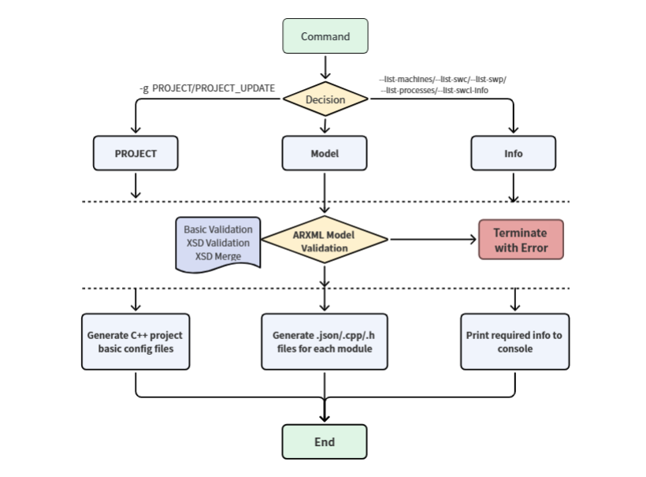
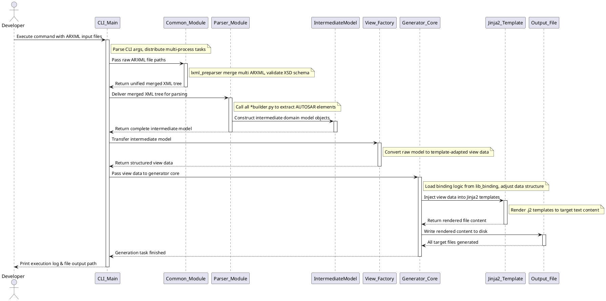
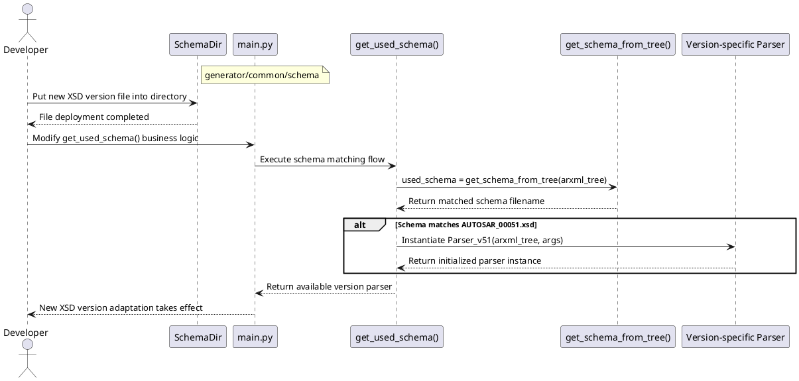
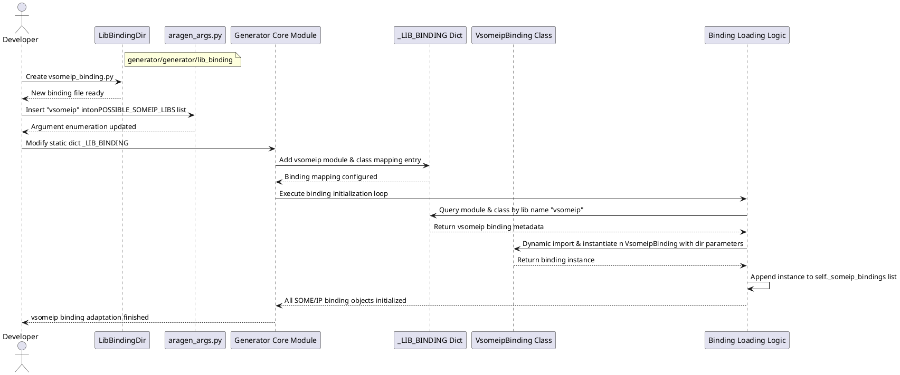

# Aragen AUTOSAR ARXML Code Generator Project Document

## Project Overview

Aragen is an AUTOSAR Adaptive Platform ARXML code generator, consisting of two core modules: Parser and Generator.

1. Parser: Traverses and parses all input ARXML files to extract complete metadata of AUTOSAR concept instances. Extracted data is categorized into three top-level domains based on business requirements: C Project, Module, Base Info. 

   - The Module domain further contains sub-objects: Components, Machines, Executables, Processes, SoftwarePackages, VehiclePackages.

2. Intermediate Model: All parsed metadata is encapsulated into unified domain objects and cached in memory as an intermediate model, serving as the single data source for the Generator layer to render configuration & code files.

Core design principle: Separation of Parsing and Generation. The Parser and Generator can be iterated and maintained independently as long as the data structure of the intermediate model remains compatible.

## Development Dependencies

| plugin      | Version |
| ----------- | ------- |
| Python      | 3.8     |
| Jinja2      | 3.1.6   |
| jsonpath    | 0.82.2  |
| lxml        | 4.9.1   |
| xmltodict   | 0.14.2  |
| pyinstaller | 6.21.0  |

## Project Directory Structure

```Plain Text
aragen/                      # Project root directory
├── aragen                   # Project entry executable
├── aragen.spec              # Package build configuration file
├── cmake/                   # CMake auxiliary scripts
├── generator/               # Core business logic root
│   ├── cli/
│   │   └── main.py          # Project entry & CLI main logic
│   ├── common/              # Common utilities, parsing public methods
│   ├── generator/           # Core code generation logic
│   ├── intermediate_model/  # Intermediate domain data model definition
│   ├── parser/              # ARXML parsing & data construction logic
│   ├── templates/           # Jinja2 code/config rendering templates (.j2)
│   └── views/               # View layer: adapt intermediate model for templates
├── README.md                # User operation & introduction document
└── requirements.txt         # Python dependency list
```

## Six-Layer Pipeline Architecture

The project adopts a six-layer pipeline architecture to convert raw ARXML model files into C++ source code, JSON configuration files and CMake project scripts. Each layer is decoupled with clear single responsibilities:

### Layer 1: CLI Layer (`generator/cli/main.py`)

- Core capability: Command line parameter parsing based on `argparse`; multi-process task scheduling via `multiprocessing`.

### Layer 2: Common Layer (`generator/common/`)

Public utility library shared by parsing & generation layers:

- `lxml_preparser.py`: Preprocessing and merging of raw ARXML XML trees

- `arxml_merger.py`: Merge multiple split ARXML files (support `atpSplitable` nodes)

- `autosar_mapping.py`: AUTOSAR XML element naming conversion (dash → underscore)

- `tree_helper.py`: Generic XML DOM tree traversal & modification tools

- `schema/`: AUTOSAR XSD schema definition files (v49 baseline)

### Layer 3: Parsing Layer (`generator/parser/`)

Responsible for converting ARXML XML tree into structured intermediate model objects. Each builder file corresponds to one AUTOSAR business module:

- `default_parser.py`: Unified global parser entry

- Module builders: Process, Machine, Executable, Service Interface, Network Binding, Diagnosis, PHM, Crypto, E2E, IAM, IDSM, State Management, Network Management XML, Software Package, Vehicle Package, QoS

### Layer 4: Intermediate Model Layer (`generator/intermediate_model/`)

Pure data domain model, completely decoupled from ARXML XML format definition. All business data is standardized into unified Python objects here, acting as the data bus between parsing and generation.

### Layer 5: View Layer (`generator/views/`)

Data adaptation layer: Convert coarse-grained intermediate model objects into lightweight view data tailored for template rendering, filtering redundant fields and organizing data structures matching template requirements.

### Layer 6: Generation Layer (`generator/generator/`)

Render views + Jinja2 templates to output target files (C++ code, JSON, CMakeLists.txt etc.)

- `generator.py`: Top-level generator orchestration core

- `generator_settings.py`: Global generation behavior configuration

- `template_renderer.py`: Jinja2 template engine encapsulation

- `model_adjust.py`: Post-processing & correction of view data

- `datatype_container.py`: Unified storage & management of AUTOSAR data types

- `lib_binding/`: SOMEIP network binding generator submodule 

  - `nsomeip2_binding.py`

  - `npc_binding.py`

  - `icc_binding.py`

  - `fastdds_binding.py`

## Core Business Flow

1. CLI receives input parameters and ARXML file paths, distributes parsing tasks via multi-process

2. Common layer preprocesses, merges and normalizes all ARXML files based on XSD schema

3. Parser layer builds business module objects and assembles the complete intermediate model

4. View layer refactors intermediate model into template-friendly view data

5. Generator layer loads Jinja2 templates, renders files based on view data, and outputs to target directory



## Team Collaboration Workflow



## Common Adaptation & Extension Guide

### 7.1 Add support for new AUTOSAR XSD versions

Example: Adapt for `AUTOSAR_00051.xsd`

1. Place the new XSD schema file under `generator/common/schema/`

2. Modify the schema matching branch in `main.py` to instantiate a version-specific parser:

```python
used_schema = get_schema_from_tree(arxml_tree)
if used_schema == "AUTOSAR_00051.xsd":
    used_parser = Parser_v51(arxml_tree, args)
```



### 7.2 Integrate new SOMEIP binding implementations (e.g. vsomeip)

1. Create new binding logic file `vsomeip_binding.py` under `generator/generator/lib_binding/`; reference existing `nsomeip2_binding.py` for implementation standards

2. Update CLI optional parameters in `generator/common/aragen_args.py`, add new binding identifier to the enum list:

```Python
POSSIBLE_SOMEIP_LIBS = ["vsomeip", "nsomeip2", "none"]
```

3. Extend the binding mapping dictionary `_LIB_BINDING` in generator core code:

```Python
_LIB_BINDING = {
    'someip': {
        'nsomeip2': {
                'module': _LIB_BINDING_PACKAGE + '.nsomeip2_binding',
                'class': 'Nsomeip2Binding',
        },
        'vsomeip': {
            'module': _LIB_BINDING_PACKAGE + '.vsomeip_binding',
            'class': 'VsomeipBinding',
        }
    }
    ......
}
```

4. Dynamic loading logic automatically instantiates the new binding class based on user input parameters:

```Python
self._someip_bindings = []
for name in self._settings.someip_libs:
    module = importlib.import_module(Generator._LIB_BINDING['someip'][name]['module'])
    BindingCls = getattr(module, Generator._LIB_BINDING['someip'][name]['class'])
    binding = BindingCls(self._renderer, self.net_bindings_root_dir, self.machines_root_dir, self.processes_root_dir)
    self._someip_bindings.append(binding)
```



### 7.3 Other Modification Scenarios

1. Adjust module data extraction logic: Modify corresponding builder files under `generator/parser/`

2. Modify global file generation logic: Modify `generator/generator/generator.py`

3. Adjust output code/config content: Modify corresponding Jinja2 template files under `generator/templates/`

## User Usage Instructions

Complete startup parameters, command examples and configuration descriptions are documented in `README.md`.
