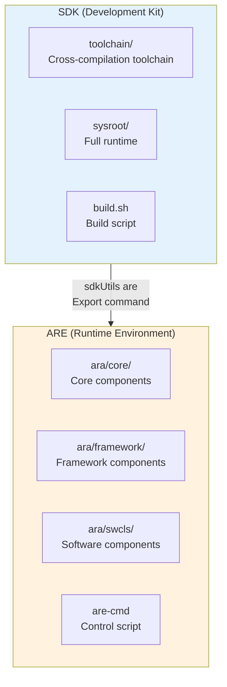
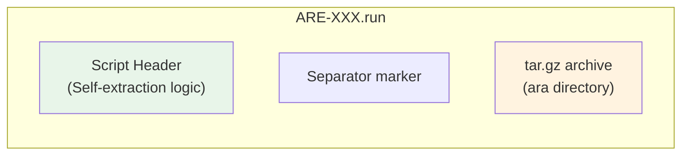
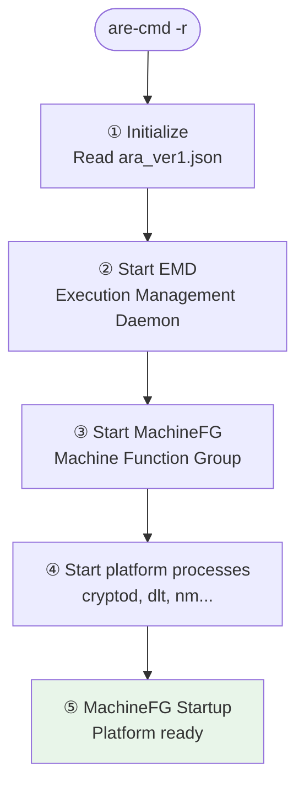
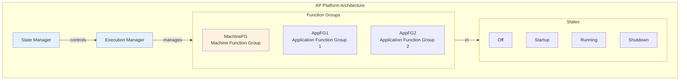
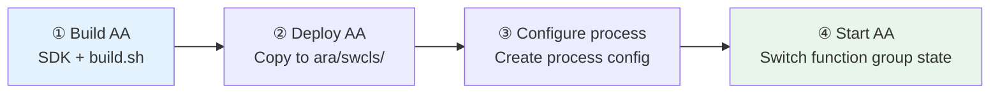
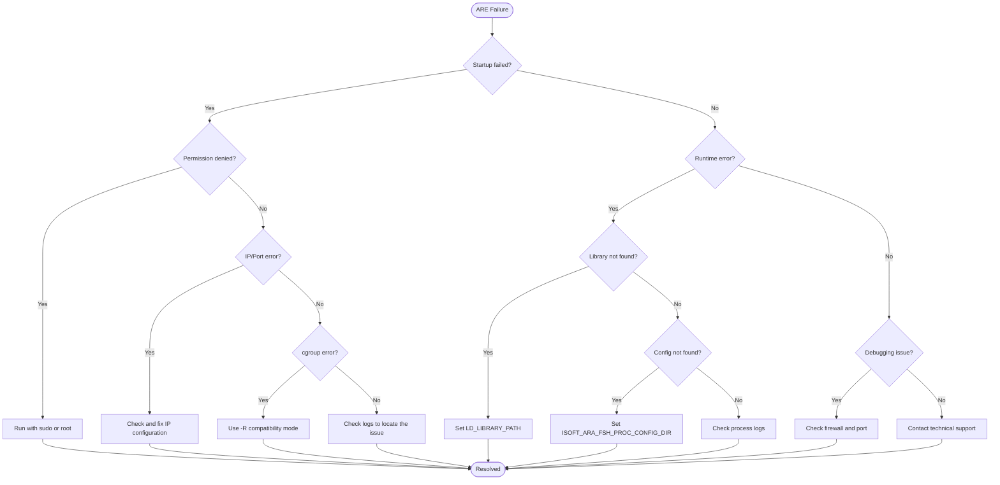

# ARE User Manual

> **Document Version**: v2.0 | **Applicable Version**: AP ARE 2.0+ | **Last Updated**: 2026-04-16

---

## Table of Contents

1. [Overview](#1-overview)
2. [System Requirements and Constraints](#2-system-requirements-and-constraints)
3. [Obtaining ARE](#3-obtaining-are)
4. [Installation and Deployment](#4-installation-and-deployment)
5. [ARE Directory Structure](#5-are-directory-structure)
6. [Starting and Stopping the AP Platform](#6-starting-and-stopping-the-ap-platform)
7. [Function Group and State Machine Management](#7-function-group-and-state-machine-management)
8. [Running Adaptive Applications (AA)](#8-running-adaptive-applications-aa)
9. [Debug Mode](#9-debug-mode)
10. [Configuration Files](#10-configuration-files)
11. [FAQ and Troubleshooting](#11-faq-and-troubleshooting)
12. [Appendix](#12-appendix)

---

## 1. Overview

### 1.1 What is ARE?

**ARE (Adaptive platform Runtime Environment)** is the runtime environment for ISOFT's **Adaptive Platform (AP)**. It is used to deploy and run AP platform services and Adaptive Applications (AA) on target machines.

The core design philosophy of ARE is: **lightweight, one-click deployment, run anywhere**.

### 1.2 Core Capabilities of ARE

| Capability                       | Description                                                                   |
| -------------------------------- | ----------------------------------------------------------------------------- |
| **Self-extracting installation** | `.run` or `.ist` self-extracting package; no additional dependencies required |
| **One-click start/stop**         | Start/stop the AP platform with a single `are-cmd` script                     |
| **Function Group management**    | Supports Function Group state transitions                                     |
| **State Machine management**     | Supports State Machine state transitions                                      |
| **Debug support**                | Built-in TCP debug protocol for IDE remote debugging                          |
| **Process tracing**              | Supports startup tracing and breakpoint debugging for specified processes     |
| **Resource limits**              | Supports CPU and memory limits (cgroup)                                       |
| **Compatibility mode**           | Supports stripped-down kernels without cgroup support                         |

### 1.3 ARE vs SDK



| Aspect                    | SDK                           | ARE                                       |
| ------------------------- | ----------------------------- | ----------------------------------------- |
| **Size**                  | Hundreds of MB ~ several GB   | Tens of MB ~ hundreds of MB               |
| **Toolchain**             | ✅ Full cross-compiler         | ❌ Not included                            |
| **Headers**               | ✅ Full development headers    | ❌ Runtime-only                            |
| **Purpose**               | **Development & compilation** | **Target machine deployment & execution** |
| **Installation location** | Development workstation       | Embedded target machine                   |
| **Main script**           | `build.sh`                    | `are-cmd`                                 |

### 1.4 ARE File Naming Convention

ARE package filenames follow this format:

```
ARE-{apall_version}-{target_arch}-{host_osv}-{toolchain}-{build_type}-{tag}.run
```

**Examples:**

```bash
# Native runtime environment (x86_64 Ubuntu 20.04)
ARE-1.0.0-x86_64-ubuntu20.04-native-Release-20251202182442.run

# Cross-compiled runtime environment (aarch64 target)
ARE-1.0.0-aarch64-linux-j5-Release-BMW730.run
```

**Naming segments:**

| Segment         | Example                 | Description                 |
| --------------- | ----------------------- | --------------------------- |
| `apall_version` | `1.0.0`                 | APALL source version number |
| `target_arch`   | `x86_64` / `aarch64`    | Target program architecture |
| `host_osv`      | `ubuntu20.04` / `linux` | Host operating system       |
| `toolchain`     | `native` / `j5`         | Toolchain name              |
| `build_type`    | `Release` / `Debug`     | Build type                  |
| `tag`           | `20251202182442`        | Timestamp or custom tag     |

---

## 2. System Requirements and Constraints

### 2.1 Hardware Requirements

| Resource              | Minimum                         | Recommended                     | Notes                                                                 |
| --------------------- | ------------------------------- | ------------------------------- | --------------------------------------------------------------------- |
| **CPU architecture**  | Matches SDK target architecture | Matches SDK target architecture | Must match the SDK architecture used to compile ARE                   |
| **CPU cores**         | 1 core                          | 2+ cores                        | AP platform services require some compute resources                   |
| **Memory**            | 1 GB                            | 2 GB+                           | Ensure sufficient memory for AP platform and upper-layer applications |
| **Disk space**        | 1 GB                            | 5 GB+                           | Minimal config can be < 100 MB; full config may be > 1 GB             |
| **Network interface** | At least one usable             | At least one usable             | For communication services and debugging                              |

### 2.2 Operating System Requirements

| Operating System   | Version              | Status                             |
| ------------------ | -------------------- | ---------------------------------- |
| **Ubuntu**         | 20.04 LTS            | ✅ Fully supported                  |
| **Ubuntu**         | 22.04 LTS            | ✅ Supported                        |
| **Embedded Linux** | Stripped-down kernel | ⚠️ Requires compatibility mode (-R) |
| **Other Linux**    | -                    | ⚠️ Requires verification            |

### 2.3 Software Dependencies

ARE requires the following software environment:

| Category                   | Requirement   | Notes                           |
| -------------------------- | ------------- | ------------------------------- |
| **C/C++ runtime library**  | glibc or musl | Base runtime library            |
| **bash**                   | 4.0+          | Script execution environment    |
| **Network protocol stack** | TCP/IP        | For communication and debugging |
| **cgroup** (optional)      | v1 or v2      | For resource limits (-r mode)   |

### 2.4 Permission Requirements

- **Root privileges**: Starting the AP platform requires root or sudo privileges.
- **Reason**: Needs to create `/run/ara/` directories, mount cgroups, bind network ports, etc.

---

## 3. Obtaining ARE

### 3.1 Acquisition Methods

| Method               | Description                                             | Use Case               |
| -------------------- | ------------------------------------------------------- | ---------------------- |
| **Export from SDK**  | Use the SDK's built-in `sdkUtils are` command to export | Development & testing  |
| **Official release** | Obtain pre-compiled ARE from ISOFT's official channels  | Production environment |
| **CI/CD output**     | Obtain from continuous integration system               | Automated deployment   |

### 3.2 Exporting ARE from SDK

```bash
# Enter the SDK directory
cd /opt/ap-sdk/ara-sysroot

# Export ARE (default configuration)
./ara-tools/sdkUtils are -o ./output ./

# Export fully stripped ARE (minimal size)
./ara-tools/sdkUtils are -s 3 -o ./output ./

# Export as tar.gz format (non-self-extracting)
./ara-tools/sdkUtils are -t tar -o ./output ./
```

#### Export Options

| Option        | Description                                            | Default           |
| ------------- | ------------------------------------------------------ | ----------------- |
| `-o <DIR>`    | Output directory                                       | Current directory |
| `-t <TYPE>`   | Export type: `are` (self-extracting) or `tar` (tar.gz) | `are`             |
| `-s <LEVEL>`  | Strip level: `0`/`1`/`2`/`3`                           | `0`               |
| `-f <CONFIG>` | Export configuration file                              | None              |

#### Strip Levels

| Level | Name             | Description                             | Size     |
| ----- | ---------------- | --------------------------------------- | -------- |
| `0`   | No stripping     | Retain all files                        | Largest  |
| `1`   | File stripping   | Remove unnecessary dependency libraries | Medium   |
| `2`   | Binary stripping | Strip all ELF files                     | Smaller  |
| `3`   | Full stripping   | File stripping + binary stripping       | Smallest |

---

## 4. Installation and Deployment

### 4.1 ARE Package Structure

The ARE package is a **self-extracting Bash script** with the following structure:



### 4.2 Installing ARE

#### 4.2.1 Basic Installation

```bash
# Install to the current directory
./ARE-1.0.0-x86_64-ubuntu20.04-native-Release.run ./

# Install to a specified directory
./ARE-1.0.0-x86_64-ubuntu20.04-native-Release.run /opt/ap-are

# Install to the user's home directory
./ARE-1.0.0-x86_64-ubuntu20.04-native-Release.run ~/ap-are
```

**Installation output example:**

```
Unpacking files ...
Updating are-cmd ...
the ara runtime root is at: /opt/ap-are, to startup the ara you can run:
        /opt/ap-are/are-cmd
```

#### 4.2.2 View Version Information (Without Installing)

```bash
./ARE-1.0.0-x86_64-ubuntu20.04-native-Release.run -v
```

Output example:

```ini
[sdk]
SDK_NAME = SDK-1.0.0-x86_64-x86_64-ubuntu20.04-native-release
SDK_VERSION = 1.0.0
SDK_BUILD_TYPE = release
SDK_SOURCE_COMMITID = 89d2707a44c92c951d47a93e76c702862c1a6818

[are]
ARE_ARCH = x86_64
ARE_TAG = 20251202182442
ARE_INSTALL_SIZE = 231
```

### 4.3 Post-Installation Verification

After installation, verify ARE integrity:

```bash
cd /opt/ap-are  # Your installation directory

# Check directory structure
ls -la
# Should contain: are-cmd and ara/

# Check the control script
ls -la are-cmd

# Check AP platform components
ls -la ara/framework/
ls -la ara/core/

# Check version information
cat ara/ara_ver1.json | jq .
```

### 4.4 Uninstalling ARE

ARE provides a self-uninstall feature:

```bash
# Uninstall ARE
/opt/ap-are/are-cmd -u

# Or execute from within the directory
./are-cmd -u
```

Uninstallation will delete all files and directories created during installation. **Please ensure you have backed up important data**.

---

## 5. ARE Directory Structure

### 5.1 Top-Level Directory Structure

The ARE directory structure after installation:

```
/opt/ap-are/                          # ARE installation root directory
├── are-cmd                           # ARE control script ⭐
├── release                           # Release information file
└── ara/                              # AP platform runtime directory
    ├── ara_ver1.json                 # AP platform component configuration ⭐
    ├── ara_ver1.md5                  # Configuration file checksum
    ├── core/                         # Core software collection
    │   └── ${VERSION}/
    │       ├── bin/                  # Executables
    │       ├── etc/                  # Configuration files
    │       │   ├── machine/          # Machine configuration
    │       │   ├── state_manager/    # State management configuration
    │       │   ├── nsomeip_routing_proc/  # Routing process configuration
    │       │   └── .../              # Other process configurations
    │       └── swcl_manifest.json    # Software collection manifest
    ├── framework/                    # Framework software collection
    │   └── ${VERSION}/
    │       ├── bin/                  # Executables
    │       ├── sbin/                 # System executables (emd, etc.)
    │       ├── lib/                  # Dynamic libraries
    │       ├── etc/                  # Configuration files
    │       └── swcl_manifest.json
    ├── swcls/                        # Software component library (SWCL)
    │   ├── ${SWC_NAME}/
    │   │   └── ${VERSION}/
    │   │       ├── bin/              # Executables
    │   │       └── lib/              # Dynamic libraries
    │   └── run_time_application_swcl_list_ver1.json
    └── var/                          # Runtime variable data
```

### 5.2 Key Files

| File/Directory                          | Description                         | Purpose                                                                     |
| --------------------------------------- | ----------------------------------- | --------------------------------------------------------------------------- |
| `are-cmd`                               | ARE control script                  | Start/stop AP platform, function group management, state machine management |
| `ara/ara_ver1.json`                     | AP platform component configuration | Defines versions and paths for core, framework, swcls                       |
| `ara/framework/${VERSION}/sbin/emd`     | Execution Management Daemon         | AP platform core process                                                    |
| `ara/core/${VERSION}/bin/state_manager` | State Management process            | Manages function groups and state machines                                  |
| `release`                               | Release information                 | SDK version, ARE version, install size, etc.                                |

### 5.3 ara_ver1.json Details

```json
{
    "core": {
        "path": "ara/core/1.0.0",
        "version": "1.0.0"
    },
    "framework": {
        "path": "ara/framework/1.0.0",
        "version": "1.0.0"
    },
    "swcls": {
        "path": "ara/swcls",
        "version": "1.0.0"
    },
    "var": {
        "path": "ara/var",
        "version": "1.0.0"
    }
}
```

| Field       | Description                                    |
| ----------- | ---------------------------------------------- |
| `core`      | Core software collection path and version      |
| `framework` | Framework software collection path and version |
| `swcls`     | Software component library root path           |
| `var`       | Runtime variable data directory                |

---

## 6. Starting and Stopping the AP Platform

### 6.1 AP Platform Startup Flow



### 6.2 Starting the AP Platform

#### 6.2.1 Normal Mode (Recommended)

Normal mode enables CPU and memory limits (cgroup). Suitable for full-feature testing and production environments.

```bash
# Enter the ARE directory
cd /opt/ap-are

# Start the AP platform
./are-cmd -r
```

**Startup output example:**

```
+++++++++++++++++++++ araLoader::Config::Debug() +++++++++++++++++++++
AraSysrootDir: /opt/ap-are
AraConfig: /opt/ap-are/ara/ara_ver1.json
FrameworkDir: /opt/ap-are/ara/framework/
FrameworkVersion: 1.0.0
CoreDir: /opt/ap-are/ara/core/
CoreVersion: 1.0.0
...
2025/12/02 19:23:44.641 115  EMD #EMD Info [  bengin to Startup the MachineFG.]
...
2025/12/02 19:23:45.491 63  EMD #EMD Info [  FunctionGroup { /ISOFT/FunctionGroupSet/Machine1/MachineFG } change to Startup state]
```

**Success indicator:**

```
FunctionGroup { /ISOFT/FunctionGroupSet/Machine1/MachineFG } change to Startup state
```

#### 6.2.2 Compatibility Mode

Compatibility mode **disables** resource limits. Suitable for non-Linux or stripped-down kernels without cgroup support.

```bash
# Start in compatibility mode
./are-cmd -R
```

### 6.3 Stopping the AP Platform

#### 6.3.1 Quick Shutdown (Ctrl+C)

Press `Ctrl+C` directly in the **terminal where the AP platform was started**:

```bash
# Output after pressing Ctrl+C:
2025/12/02 19:20:58.010 162  EMD #EMD Info [  Stop the emd Rudely.]
...
2025/12/02 19:20:58.143 210  EMD #EMD Info [  ExecutionManager is Terminated !!!]
```

**Characteristics:**

- All processes are forcefully killed (SIGKILL)
- Processes do not perform normal cleanup
- Suitable for quick termination after debugging

#### 6.3.2 Graceful Shutdown

Execute the shutdown command in a **new terminal window**:

```bash
# Gracefully shut down the AP platform
/opt/ap-are/are-cmd -s
```

**Shutdown output example:**

```
2025/12/02 19:24:26.701 163  EMD #EMD Info [  the MachineFG will be Off]
...
2025/12/02 19:24:27.160 110  EMD #EMD Info [  ExecutionManager is Terminated !!!]
```

**Characteristics:**

- AP platform performs normal shutdown procedures
- All processes exit gracefully in order
- Suitable for full-flow testing or production scenarios

### 6.4 are-cmd Command Quick Reference

| Command        | Function                 | Blocking              | Use Case                          |
| -------------- | ------------------------ | --------------------- | --------------------------------- |
| `./are-cmd -r` | Normal mode start        | ✅ Blocking            | Full-feature testing, production  |
| `./are-cmd -R` | Compatibility mode start | ✅ Blocking            | Environments without cgroup       |
| `./are-cmd -s` | Graceful shutdown        | ❌ Returns immediately | Graceful stop                     |
| `./are-cmd -u` | Uninstall ARE            | ❌ Returns immediately | Environment cleanup               |
| `Ctrl+C`       | Quick shutdown           | -                     | Quick termination after debugging |

---

## 7. Function Group and State Machine Management

### 7.1 Core Concepts



**Function Group (FG):**

- A collection of related processes
- Has an independent state machine (Off → Startup → Running → Shutdown → Off)
- MachineFG is the first function group to run at system startup

**State Machine (SM):**

- Manages the combined state of multiple function groups
- Defines state transition rules through transition tables
- Used to implement complex system state management

### 7.2 Switching Function Group States

```bash
# Switch MachineFG to Verify state
./are-cmd -c MachineFG.Verify

# Switch MachineFG to Off state
./are-cmd -c MachineFG.Off
```

**Parameter format:** `FunctionGroupShortName.State`

**Common states:**

| State      | Description                                |
| ---------- | ------------------------------------------ |
| `Off`      | Off state; all processes stopped           |
| `Startup`  | Startup state; processes are being started |
| `Running`  | Running state; processes running normally  |
| `Shutdown` | Shutting down; processes are being stopped |
| `Verify`   | Verification state (user-defined)          |

### 7.3 Querying Function Group State

```bash
# Query the current state of MachineFG
./are-cmd -C MachineFG

# Output example:
MachineFG.Startup
```

### 7.4 Switching State Machine States

```bash
# Switch MachineSM to the state defined by transition table 1
./are-cmd -m MachineSM.1
```

**Parameter format:** `StateMachineShortName.TransitionTableNumber`

### 7.5 Querying State Machine State

```bash
# Query the current state of MachineSM
./are-cmd -M MachineSM

# Output example:
MachineSM.Initial
```

---

## 8. Running Adaptive Applications (AA)

### 8.1 AA Deployment Flow



### 8.2 Deploying AA to ARE

#### 8.2.1 Building AA

Use the SDK to compile the adaptive application:

```bash
# Load the SDK environment
source /opt/ap-sdk/ara-sysroot/build.sh

# Enter the AA project directory
cd ~/my-aa-projects/MyAdaptiveApp

# Build
ab -i

# Get build artifacts
ls .build/bin/MyAdaptiveApp
```

#### 8.2.2 Installing AA into ARE

```bash
# Create the AA directory structure
mkdir -p /opt/ap-are/ara/swcls/MyAdaptiveApp/1.0.0/bin
mkdir -p /opt/ap-are/ara/swcls/MyAdaptiveApp/1.0.0/lib

# Copy the executable
cp ~/my-aa-projects/MyAdaptiveApp/.build/bin/MyAdaptiveApp \
   /opt/ap-are/ara/swcls/MyAdaptiveApp/1.0.0/bin/

# Copy dynamic libraries (if any)
cp ~/my-aa-projects/MyAdaptiveApp/.build/lib/*.so \
   /opt/ap-are/ara/swcls/MyAdaptiveApp/1.0.0/lib/

# Copy configuration files
cp -r ~/my-aa-projects/MyAdaptiveApp/etc \
   /opt/ap-are/ara/swcls/MyAdaptiveApp/1.0.0/
```

#### 8.2.3 Configuring the Process

Configure the AA process in ARE so it can be managed by EMD:

Edit `ara/core/${VERSION}/etc/process/my_aa_proc.json`:

```json
{
    "process": {
        "name": "my_aa_proc",
        "executable": "/opt/ap-are/ara/swcls/MyAdaptiveApp/1.0.0/bin/MyAdaptiveApp",
        "arguments": [],
        "environment": {
            "LD_LIBRARY_PATH": "/opt/ap-are/ara/swcls/MyAdaptiveApp/1.0.0/lib:/opt/ap-are/ara/framework/1.0.0/lib"
        },
        "dependencies": [],
        "schedulingPolicy": "OTHER",
        "schedulingPriority": 0
    }
}
```

### 8.3 Starting AA

#### 8.3.1 Starting via Function Group

Configure the AA process into a function group, then start it by switching the function group state:

```bash
# Assuming AA is configured in the AppFG function group
./are-cmd -c AppFG.Startup
```

#### 8.3.2 Running AA Directly (Debug)

```bash
# Set environment variables
export LD_LIBRARY_PATH="/opt/ap-are/ara/framework/1.0.0/lib:\
/opt/ap-are/ara/swcls/MyAdaptiveApp/1.0.0/lib:\
/opt/ap-are/usr/lib"

export ISOFT_ARA_FSH_SYSROOT="/opt/ap-are"
export ISOFT_ARA_FSH_PROC_CONFIG_DIR="/opt/ap-are/ara/swcls/MyAdaptiveApp/1.0.0/etc/process"

# Run AA
/opt/ap-are/ara/swcls/MyAdaptiveApp/1.0.0/bin/MyAdaptiveApp
```

---

## 9. Debug Mode

### 9.1 Debug Mode Overview

ARE supports TCP-based remote debugging, which can be used with IDEs for:

- Process tracing
- Breakpoint debugging
- Function group/process state monitoring
- State transition control

### 9.2 Starting Debug Mode

```bash
# Start in debug mode (default port 6000)
./are-cmd -r -d

# Specify a debug port
./are-cmd -r -d 7000
```

**Debug mode characteristics:**

- EMD pauses before starting MachineFG, waiting for IDE connection
- Supports process trace requests (specify which processes need breakpoints)
- Supports state queries and transitions

### 9.3 Debug Protocol

#### 9.3.1 Protocol Format

```
0                      15                     31
------------------------------------------------
|       MAGIC_ID       |          LENGTH       |
------------------------------------------------
|                  CONTENTS (JSON)             |
|                   ... ...                    |
------------------------------------------------
```

| Field      | Description                              |
| ---------- | ---------------------------------------- |
| `MAGIC_ID` | `0x4441` (network byte order, i.e. "AD") |
| `LENGTH`   | Total packet length (2 bytes)            |
| `CONTENTS` | JSON-formatted command or data           |

#### 9.3.2 Process Tracing

**Request to trace processes:**

```json
{
    "type": "trace_request",
    "value": [
        "/isoft/core/cryptod_proc",
        "/isoft/core/state_manager"
    ]
}
```

**Server push (process started):**

```json
{
    "type": "trace_response",
    "value": {
        "name": "/isoft/core/cryptod_proc",
        "state": "init",
        "pid": 1001,
        "exit_code": 0
    }
}
```

#### 9.3.3 Information Retrieval

**Get function group information:**

```json
// Request
{
    "type": "request_function_group",
    "value": "/isoft/core/MachineFG"
}

// Response
{
    "type": "response_function_group",
    "value": {
        "name": "/isoft/core/MachineFG",
        "state": "Startup",
        "process_list": [
            {
                "name": "/isoft/core/cryptod_proc",
                "state": "Running",
                "pid": 1001,
                "exit_code": 0
            }
        ]
    }
}
```

**Get process information:**

```json
// Request
{
    "type": "request_process",
    "value": "/isoft/core/cryptod_proc"
}

// Response
{
    "type": "response_process",
    "value": {
        "name": "/isoft/core/cryptod_proc",
        "state": "Running",
        "pid": 1001,
        "exit_code": 0
    }
}
```

#### 9.3.4 State Notifications

The server actively pushes state changes:

```json
// Process state change
{
    "type": "notify_process",
    "value": {
        "name": "/isoft/core/cryptod_proc",
        "state": "Running",
        "pid": 1001,
        "exit_code": 0
    }
}

// Function group state change
{
    "type": "notify_function_group",
    "value": {
        "name": "/isoft/core/MachineFG",
        "state": "Startup",
        "process_list": [...]
    }
}
```

---

## 10. Configuration Files

### 10.1 release File

The `release` file records ARE's release information.

**Location:** `ARE_INSTALL_DIR/release`

**Content example:**

```ini
[sdk]
SDK_NAME = SDK-1.0.0-x86_64-x86_64-ubuntu20.04-native-release
SDK_VERSION = 1.0.0
SDK_BUILD_TYPE = release
SDK_SOURCE_COMMITID = 89d2707a44c92c951d47a93e76c702862c1a6818

[are]
ARE_ARCH = x86_64
ARE_TAG = 20251202182442
ARE_INSTALL_SIZE = 231
```

**Field descriptions:**

| Field                 | Description                                    |
| --------------------- | ---------------------------------------------- |
| `SDK_NAME`            | Name of the SDK package that generated the ARE |
| `SDK_VERSION`         | SDK version number                             |
| `SDK_BUILD_TYPE`      | SDK build type (release/debug)                 |
| `SDK_SOURCE_COMMITID` | APALL source Git commit ID                     |
| `ARE_ARCH`            | ARE target architecture                        |
| `ARE_TAG`             | User-defined tag                               |
| `ARE_INSTALL_SIZE`    | Installed size (MB)                            |

### 10.2 ara_ver1.json

`ara_ver1.json` is the AP platform component configuration file.

**Location:** `ARE_INSTALL_DIR/ara/ara_ver1.json`

**Content example:**

```json
{
    "core": {
        "path": "ara/core/1.0.0",
        "version": "1.0.0"
    },
    "framework": {
        "path": "ara/framework/1.0.0",
        "version": "1.0.0"
    },
    "swcls": {
        "path": "ara/swcls",
        "version": "1.0.0"
    },
    "var": {
        "path": "ara/var",
        "version": "1.0.0"
    }
}
```

### 10.3 Process Configuration File

The process configuration file defines the properties of processes managed by EMD.

**Location:** `ara/core/${VERSION}/etc/process/*.json`

**Content example:**

```json
{
    "process": {
        "name": "cryptod_proc",
        "executable": "${ARA_CORE_DIR}/bin/cryptod",
        "arguments": [],
        "environment": {
            "LD_LIBRARY_PATH": "${ARA_FRAMEWORK_DIR}/lib"
        },
        "dependencies": [],
        "schedulingPolicy": "OTHER",
        "schedulingPriority": 0,
        "resourceGroup": "default"
    }
}
```

**Field descriptions:**

| Field                | Description                       |
| -------------------- | --------------------------------- |
| `name`               | Process name                      |
| `executable`         | Executable file path              |
| `arguments`          | Startup arguments list            |
| `environment`        | Environment variables             |
| `dependencies`       | Other processes this depends on   |
| `schedulingPolicy`   | Scheduling policy (OTHER/FIFO/RR) |
| `schedulingPriority` | Scheduling priority               |
| `resourceGroup`      | Resource group                    |

### 10.4 Function Group Configuration File

The function group configuration file defines the processes contained in a function group.

**Location:** `ara/core/${VERSION}/etc/machine/machine_manifest.json`

**Content example:**

```json
{
    "functionGroups": [
        {
            "name": "MachineFG",
            "processes": [
                "cryptod_proc",
                "dlt_daemon_proc",
                "state_manager",
                "nsomeip_routing_proc"
            ]
        }
    ]
}
```

---

## 11. FAQ and Troubleshooting

### 11.1 Startup Issues

#### Issue 1: Insufficient Permissions

**Symptom:**

```
Create directory(/run/ara/...) failed - : Permission denied
SingleInstance(): Create Directory(...) failed - : Permission denied
EMD exited with 255
```

**Cause:** Running without root privileges.

**Solution:**

```bash
# Run with sudo
sudo ./are-cmd -r

# Or switch to root
su root
./are-cmd -r
```

#### Issue 2: IP Address Configuration Error

**Symptom:**

```
errno 99, Cannot assign requested address, dgram endpoint(192.168.1.100:30490) bind address failed
Communication Stack Error
nsomeip_routing_proc Terminated by signal 11
```

**Cause:** The IP address configured in ARE does not match the target machine's actual IP.

**Solution:**

```bash
# View current IP
ip addr

# Modify the IP configuration in ARE
sed -i "s/192.168.1.100/192.168.2.200/g" \
    /opt/ap-are/ara/core/1.0.0/etc/*/nsomeip.json

# Restart
./are-cmd -r
```

#### Issue 3: Port Already in Use

**Symptom:**

```
bind address failed, Address already in use
```

**Cause:** A previous ARE instance was not fully shut down, or there is a port conflict with another program.

**Solution:**

```bash
# Find the process occupying the port
sudo lsof -i :30490

# Terminate the process
sudo kill -9 <PID>

# Or wait a while and retry
sleep 5
./are-cmd -r
```

### 11.2 Runtime Issues

#### Issue 4: Shared Library Not Found

**Symptom:**

```
error while loading shared libraries: libara_com.so: cannot open shared object file
```

**Cause:** `LD_LIBRARY_PATH` is not set correctly.

**Solution:**

```bash
# Check if the library file exists
ls /opt/ap-are/ara/framework/1.0.0/lib/libara_com.so

# Set the environment variable
export LD_LIBRARY_PATH="/opt/ap-are/ara/framework/1.0.0/lib:\
/opt/ap-are/usr/lib:\
/opt/ap-are/ara/swcls/MyApp/1.0.0/lib"

# Re-run
./are-cmd -r
```

#### Issue 5: Configuration File Not Found

**Symptom:**

```
Failed to load manifest file: No such file or directory
```

**Cause:** `ISOFT_ARA_FSH_PROC_CONFIG_DIR` is not set correctly.

**Solution:**

```bash
# Set the configuration directory environment variable
export ISOFT_ARA_FSH_PROC_CONFIG_DIR="/opt/ap-are/ara/swcls/MyApp/1.0.0/etc/process"

# Re-run
./are-cmd -r
```

### 11.3 Debugging Issues

#### Issue 6: IDE Cannot Connect to Debug Port

**Symptom:** IDE connection times out or is refused.

**Cause:**

1. Firewall blocking the connection
2. Port not listening
3. IP address configuration error

**Solution:**

```bash
# Check port listening status
sudo netstat -tlnp | grep 6000

# Check firewall
sudo iptables -L | grep 6000

# Temporarily disable firewall (for testing)
sudo iptables -F

# Confirm debug mode is started
./are-cmd -r -d 6000
```

### 11.4 Other Issues

#### Issue 7: ARE Cannot Be Uninstalled

**Symptom:**

```
are uninstall ...
Remove Directory(...) failed - : Directory not empty
```

**Cause:** A process is still using files in ARE.

**Solution:**

```bash
# Ensure the AP platform is stopped
./are-cmd -s

# Check for residual processes
ps aux | grep ara

# Force-terminate residual processes
sudo killall -9 emd state_manager cryptod

# Retry uninstall
./are-cmd -u
```

#### Issue 8: cgroup-Related Errors

**Symptom:**

```
_InitResourceGroup() failed
```

**Cause:** The kernel does not support cgroup, or cgroup is not properly mounted.

**Solution:**

```bash
# Start in compatibility mode (without cgroup)
./are-cmd -R

# Or manually mount cgroup
sudo mount -t cgroup2 none /sys/fs/cgroup
```

---

## 12. Appendix

### Appendix A: ARE Directory Structure (Complete)

```
/opt/ap-are/
├── are-cmd                           # ARE control script
├── release                           # Release information file
└── ara/
    ├── ara_ver1.json                 # AP platform component configuration
    ├── ara_ver1.md5                  # Configuration file checksum
    ├── core/
    │   └── 1.0.0/
    │       ├── bin/                  # Executables
    │       │   ├── cgd
    │       │   ├── cryptod
    │       │   ├── cryptohsmd
    │       │   ├── cryptox509d
    │       │   ├── dlt_daemon
    │       │   ├── dmd
    │       │   ├── fwdaemon
    │       │   ├── idsm
    │       │   ├── nm_daemon
    │       │   ├── nsomeip_routing
    │       │   ├── package_manager
    │       │   ├── phmd
    │       │   ├── state_manager
    │       │   ├── tsync_daemon
    │       │   └── ucmm
    │       ├── etc/                  # Configuration files
    │       │   ├── machine/          # Machine configuration
    │       │   │   └── machine_manifest.json
    │       │   ├── cgd_proc/
    │       │   │   └── nsomeip.json
    │       │   ├── cryptod_proc/
    │       │   │   └── nsomeip.json
    │       │   ├── dmd/
    │       │   │   └── nsomeip.json
    │       │   ├── idsm_process1/
    │       │   │   └── nsomeip.json
    │       │   ├── nm_daemon_proc1/
    │       │   │   └── nsomeip.json
    │       │   ├── nsomeip_routing_proc/
    │       │   │   └── nsomeip.json
    │       │   ├── package_manager/
    │       │   │   └── nsomeip.json
    │       │   ├── state_manager/
    │       │   │   ├── nsomeip.json
    │       │   │   └── state_machine.json
    │       │   └── ucmm/
    │       │       └── nsomeip.json
    │       └── swcl_manifest.json    # Software collection manifest
    ├── framework/
    │   └── 1.0.0/
    │       ├── bin/                  # Executables
    │       ├── sbin/                 # System executables
    │       │   └── emd               # Execution Management Daemon
    │       ├── lib/                  # Dynamic libraries
    │       │   ├── libara_cm.so
    │       │   ├── libara_com.so
    │       │   ├── libara_crypto.so
    │       │   ├── libara_diag.so
    │       │   ├── libara_exec.so
    │       │   ├── libara_fw.so
    │       │   ├── libara_nm.so
    │       │   ├── libara_per.so
    │       │   ├── libara_phm.so
    │       │   ├── libara_sm.so
    │       │   ├── libara_sync.so
    │       │   ├── libara_tsyn.so
    │       │   ├── libara_ucm.so
    │       │   └── ...
    │       └── swcl_manifest.json
    ├── swcls/                        # Software component library
    │   ├── run_time_application_swcl_list_ver1.json
    │   ├── CMDemo_client/
    │   │   └── 1.0.0/
    │   │       ├── bin/
    │   │       └── lib/
    │   ├── DiagDemo_dem_aging_dtc/
    │   ├── HelloWorld_Per/
    │   ├── NMDemo/
    │   ├── PHMDemo/
    │   └── ...
    └── var/                          # Runtime variable data
        └── ...
```

### Appendix B: Command Quick Reference

#### ARE Package Commands

| Command                     | Function                         |
| --------------------------- | -------------------------------- |
| `./ARE-XXX.run ./`          | Install to the current directory |
| `./ARE-XXX.run /opt/ap-are` | Install to a specified directory |
| `./ARE-XXX.run -v`          | View version information         |

#### are-cmd Commands

| Command                          | Function                    | Blocking |
| -------------------------------- | --------------------------- | -------- |
| `./are-cmd -r`                   | Normal mode start           | ✅        |
| `./are-cmd -R`                   | Compatibility mode start    | ✅        |
| `./are-cmd -r -d`                | Debug mode start            | ✅        |
| `./are-cmd -s`                   | Graceful shutdown           | ❌        |
| `./are-cmd -u`                   | Uninstall ARE               | ❌        |
| `./are-cmd -c MachineFG.Startup` | Switch function group state | ❌        |
| `./are-cmd -C MachineFG`         | Query function group state  | ❌        |
| `./are-cmd -m MachineSM.1`       | Switch state machine state  | ❌        |
| `./are-cmd -M MachineSM`         | Query state machine state   | ❌        |

### Appendix C: Environment Variables Quick Reference

| Variable                        | Description                     | Example Value                                   |
| ------------------------------- | ------------------------------- | ----------------------------------------------- |
| `LD_LIBRARY_PATH`               | Dynamic library search path     | `/opt/ap-are/ara/framework/1.0.0/lib`           |
| `ISOFT_ARA_FSH_SYSROOT`         | AP system root directory        | `/opt/ap-are`                                   |
| `ISOFT_ARA_FSH_PROC_CONFIG_DIR` | Process configuration directory | `/opt/ap-are/ara/swcls/MyApp/1.0.0/etc/process` |
| `ISOFT_ARA_RUNTIME_DIR`         | Runtime temporary directory     | `/run` or `/tmp`                                |

### Appendix D: Troubleshooting Flowchart



### Appendix E: Debug Protocol Packet Format

```
+------------------+------------------+------------------+
|    MAGIC_ID      |     LENGTH       |    CONTENTS      |
|    (2 bytes)     |    (2 bytes)     |    (N bytes)     |
|     0x4441       |  Network byte    |   JSON string    |
|                  |     order        |                  |
+------------------+------------------+------------------+
```

**Example packet (hex):**

```
44 41 00 3D 7B 22 74 79 70 65 22 3A 22 74 72 61
63 65 5F 72 65 71 75 65 73 74 22 2C 22 76 61 6C
75 65 22 3A 5B 22 2F 78 78 78 2F 70 72 6F 63 31
22 5D 7D
```

Decoded:

```json
{"type":"trace_request","value":["/xxx/proc1"]}
```

---

*This document is maintained by the ARE development team. For questions, please contact technical support.*

*Document version: v2.0 | Last updated: 2026-04-16*
