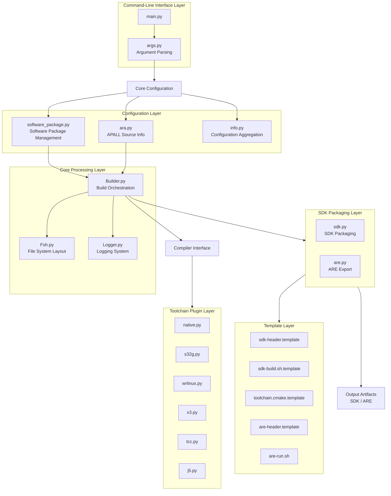
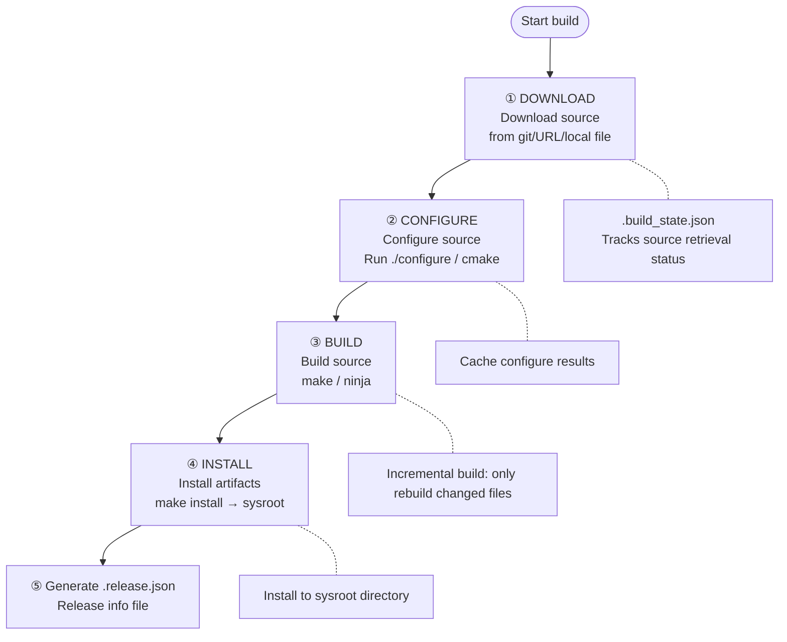
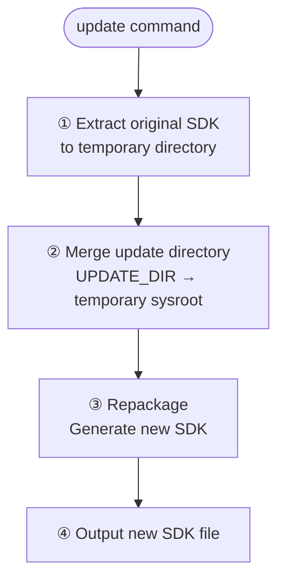
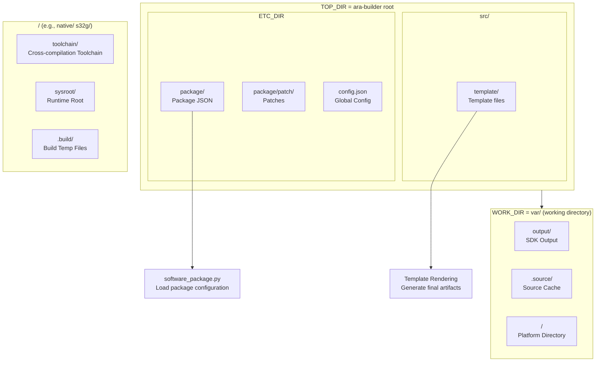
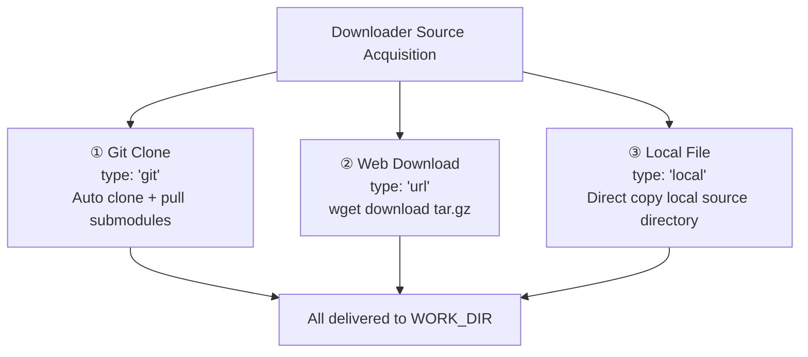
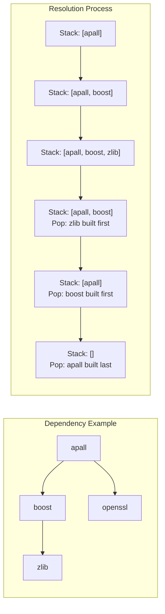
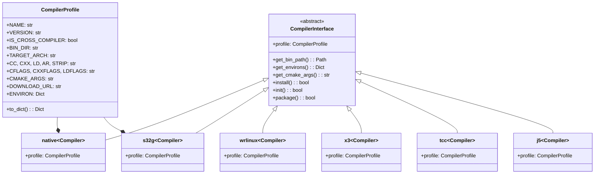

# sdk-utils User Manual

> **Document Version**: v2.0 | **Applicable Version**: sdk-utils (ara-builder) | **Last Updated**: 2026-04-16

---

## Table of Contents

1. [Overview](#1-overview)
2. [Installation and Environment Setup](#2-installation-and-environment-setup)
3. [Quick Start](#3-quick-start)
4. [Command-Line Interface Overview](#4-command-line-interface-overview)
5. [`pub` — One-Click Publishing (Recommended)](#5-pub--one-click-publishing-recommended)
6. [`build` — Build Source Code](#6-build--build-source-code)
7. [`pack` — Package SDK](#7-pack--package-sdk)
8. [`info` — Configuration Query](#8-info--configuration-query)
9. [`update` — Update SDK Content](#9-update--update-sdk-content)
10. [`are` — Export ARE Runtime Environment](#10-are--export-are-runtime-environment)
11. [Directory Structure Details](#11-directory-structure-details)
12. [Software Package Configuration](#12-software-package-configuration)
13. [Toolchain Plugin Development](#13-toolchain-plugin-development)
14. [Templates and Generated Artifacts](#14-templates-and-generated-artifacts)
15. [FAQ](#15-faq)
16. [TODO and Future Plans](#16-todo-and-future-plans)

---

## 1. Overview

### 1.1 What is sdk-utils?

`sdk-utils` (also known as `ara-builder`) is an **SDK packaging and management toolchain** designed specifically for **Adaptive Platform (AP)** embedded development scenarios. It handles:

- Compiling AP base software (APALL) from source code
- Building a complete cross-compilation toolchain (sysroot + toolchain)
- Generating distributable and portable **SDK installation packages** (self-extracting script + compressed archive)
- Exporting the **ARE (AP Runtime Environment)** runtime environment

Its core philosophy is: **configure once, build anywhere, SDK freely relocatable without reconfiguration**.

### 1.2 Key Features

| Feature                     | Description                                                                                                                   |
| --------------------------- | ----------------------------------------------------------------------------------------------------------------------------- |
| **Subcommand Architecture** | Organized via `pub` / `build` / `pack` / `info` / `update` / `are` subcommands                                                |
| **Incremental Builds**      | Tracks build status per package via `.build_state.json`, only rebuilds changed components                                     |
| **Multi-Toolchain Support** | Plugin-based architecture for easy integration of new toolchains (currently supports native / s32g / wrlinux / x3 / tcc / j5) |
| **Portable SDK**            | All scripts use relative paths; SDK can be freely relocated after installation                                                |
| **Debug Info Separation**   | Supports extracting debug information into separate files, significantly reducing SDK size                                    |
| **One-Click Build Script**  | Generated SDK includes built-in `build.sh`, supporting both command-line and source modes                                     |
| **JSON Configuration**      | All release information stored in JSON format for easy IDE integration                                                        |
| **Space-Limited Mode**      | `-s` option minimizes disk usage during compilation                                                                           |
| **Cross-Compilation**       | Auto-generates `toolchain.cmake` for cross-platform compilation                                                               |

### 1.3 System Architecture

The following Mermaid diagram describes the overall architecture of sdk-utils:



---

## 2. Installation and Environment Setup

### 2.1 System Requirements

| Dependency   | Description                                                                                    | Check Command       |
| ------------ | ---------------------------------------------------------------------------------------------- | ------------------- |
| **Python 3** | Main program runtime                                                                           | `python3 --version` |
| **jq**       | Command-line JSON processor for parsing JSON fields in templates                               | `jq --version`      |
| **pigz**     | Parallel gzip compression tool (optional but recommended), speeds up compression several times | `pigz --version`    |
| **tar**      | Archive utility                                                                                | `tar --version`     |
| **git**      | For cloning source repositories                                                                | `git --version`     |
| **wget**     | For downloading toolchain archives                                                             | `wget --version`    |

**Linux/macOS Installation Examples:**

```bash
# Debian/Ubuntu
sudo apt-get install jq pigz tar git wget build-essential libtool autoconf automake

# macOS (via Homebrew)
brew install jq pigz git wget
```

### 2.2 Obtaining sdk-utils

```bash
git clone <sdk-utils-repo-url>
cd ara-builder
```

### 2.3 Directory Structure

```
ara-builder/
├── bin/                    # Executable script entry point
│   └── sdk-utils           # Main program entry script (Python)
├── src/                    # Source code
│   ├── main.py             # Main program entry
│   ├── config/             # Configuration modules
│   │   ├── args.py         # Command-line argument parsing
│   │   ├── ara.py          # APALL source info retrieval
│   │   ├── info.py         # Configuration aggregation
│   │   └── software_package.py  # Software package management
│   ├── core/               # Core modules
│   │   ├── Fsh.py          # File system layout
│   │   ├── Builder.py      # Build orchestration
│   │   ├── Compiler.py     # Compiler abstraction interface
│   │   ├── CompilerInterface.py  # Compiler base class
│   │   ├── Object.py       # Base object collection
│   │   ├── Logger.py       # Logging system
│   │   └── decorator.py    # Decorator collection
│   ├── package/            # SDK packaging modules
│   │   ├── sdk.py          # SDK packager
│   │   └── are.py          # ARE exporter
│   ├── toolchain/          # Toolchain plugins
│   │   ├── __init__.py     # Plugin registration
│   │   ├── native.py       # Native compilation toolchain
│   │   ├── s32g.py         # NXP S32G toolchain
│   │   ├── wrlinux.py      # Wind River Linux toolchain
│   │   ├── x3.py           # ARM toolchain
│   │   ├── tcc.py          # TinyCC toolchain
│   │   └── j5.py           # J5 toolchain
│   ├── utils/              # Utility functions
│   │   ├── elf.py          # ELF file handling
│   │   └── misc.py         # Miscellaneous utilities
│   └── template/           # Template files
│       ├── sdk-header.template       # SDK header template
│       ├── sdk-build.sh.template    # SDK build script template
│       ├── toolchain.cmake.template  # CMake toolchain file template
│       ├── are-header.template       # ARE header template
│       └── are-run.sh                # ARE runtime script
├── etc/                    # Configuration files
│   ├── config.json         # Global configuration
│   └── package/            # Package configuration directory
│       ├── patch/          # Package patches
│       ├── apall.json      # APALL package configuration
│       └── boost.json      # Boost library configuration (example)
├── var/                    # Working directory (auto-created)
│   ├── .source/            # Source cache directory
│   ├── output/             # SDK output directory
│   └── <PLATFORM>/         # Per-platform build artifacts
│       ├── .build/          # Build temporary files
│       ├── sysroot/         # sysroot root directory
│       └── toolchain/       # Toolchain directory
├── example/                # Usage examples
│   └── update/             # update command examples
├── README.txt              # Project description
└── TODO.md                 # To-do list
```

---

## 3. Quick Start

### 3.1 Minimal Usage Flow (One-Click Publishing)

Assuming you have cloned the source code and configured the package JSON files, the simplest publishing command is:

```bash
# One-click publish: build from source + package SDK, fully automated
python3 bin/sdk-utils pub apall:main --toolchain native -o ./output
```

**This command automatically performs:**

1. Download/Clone APALL source code
2. Initialize native toolchain
3. Build APALL (Debug mode)
4. Package and generate SDK file (`sdk-<version>-<build-type>-<date>.bin`)

### 3.2 Step-by-Step Usage Flow

If you need more control, you can execute step by step:

```bash
# Step 1: Build
python3 bin/sdk-utils build apall:main --toolchain native

# Step 2: Package (without debug info)
python3 bin/sdk-utils pack ./var/native -o ./output

# Step 2 (alternative): Package with debug info extraction
python3 bin/sdk-utils pack ./var/native -e -o ./output
```

---

## 4. Command-Line Interface Overview

### 4.1 Full Usage

```
Adaptive Platform SDK tools

usage: sdk-utils [-h] {pub,build,pack,info,update,are} ...

Subcommands:
  pub       One-click publish: build all source and export SDK (recommended)
  build     Build source code
  pack      Package SDK
  info      Display configuration information
  update    Update SDK content
  are       Export ARE runtime environment

Global Options:
  -h, --help  Display help information
```

### 4.2 Subcommand Quick Reference

| Subcommand | Purpose                                       | Typical Scenario               |
| ---------- | --------------------------------------------- | ------------------------------ |
| `pub`      | `build` + `pack`, one-click build and publish | Daily release workflow         |
| `build`    | Build source code only                        | Debugging build process        |
| `pack`     | Package existing sysroot only                 | Repackaging                    |
| `info`     | Query toolchain/package/project configuration | Debugging configuration issues |
| `update`   | Update content of an existing SDK             | Patching an SDK                |
| `are`      | Export ARE runtime environment                | Deploying ARE                  |

---

## 5. `pub` — One-Click Publishing (Recommended)

### 5.1 Description

`pub` is the **most recommended command**. It combines `build` and `pack` into a single step: compile source → package SDK, all in one call.

### 5.2 Command Format

```
sdk-utils pub <BRANCH> [options]
sdk-utils pub -f <CONFIG_FILE> [options]
```

### 5.3 Parameters

| Parameter                           | Description                                                       | Default                               |
| ----------------------------------- | ----------------------------------------------------------------- | ------------------------------------- |
| `BRANCH`                            | APALL source version identifier, format: `branch[:version][#URL]` | **Required** (not required with `-f`) |
| `-f, --config-file CONFIG_FILE`     | Package configuration file path                                   | None                                  |
| `-t, --toolchain TOOLCHAIN`         | Toolchain name                                                    | `native`                              |
| `-v, --build-version BUILD_VERSION` | Build version number                                              | Current date (e.g., `2025-01-15`)     |
| `-b, --build-type BUILD_TYPE`       | Build type                                                        | `RelWithDebInfo`                      |
| `-s, --space-limit`                 | Enable space-limited mode                                         | `False`                               |
| `-e, --extract-debug-info`          | Extract debug info into separate file                             | `False`                               |
| `-o, --output-dir OUTPUT_DIR`       | SDK output directory                                              | `var/output/`                         |

### 5.4 Build Types

The `-b/--build-type` parameter supports the following four types:

| Type             | Description             | Optimization Level | Debug Info   | Typical Use                          |
| ---------------- | ----------------------- | ------------------ | ------------ | ------------------------------------ |
| `Debug`          | Debug mode              | `-O0`              | Full `-g`    | Development debugging                |
| `Release`        | Release mode            | `-O3`              | None         | Performance testing                  |
| `RelWithDebInfo` | Release with debug info | `-O2`              | Partial `-g` | **Default**, recommended for release |
| `MinSizeRel`     | Minimum size release    | `-Os`              | None         | Storage-constrained scenarios        |

### 5.5 Usage Examples

```bash
# Basic usage: build and package with native toolchain
python3 bin/sdk-utils pub apall:main

# Specify toolchain and build type
python3 bin/sdk-utils pub apall:v2.0 --toolchain s32g --build-type Release

# Specify custom build_version
python3 bin/sdk-utils pub apall:main -v 2025-01-15-preview --toolchain native

# Enable space-limited mode (reduce disk usage during build)
python3 bin/sdk-utils pub apall:main --space-limit

# Extract debug info during packaging (reduce SDK size)
python3 bin/sdk-utils pub apall:main --extract-debug-info

# Specify output directory
python3 bin/sdk-utils pub apall:main -o /path/to/output

# Use custom package configuration file
python3 bin/sdk-utils pub -f ./etc/package/apall.json --toolchain s32g
```

---

## 6. `build` — Build Source Code

### 6.1 Description

The `build` subcommand compiles software packages from source, supporting single or multiple packages and incremental builds.

### 6.2 Command Format

```
sdk-utils build [package_list...] [options]
sdk-utils build -f <CONFIG_FILE> [options]
```

### 6.3 Parameters

| Parameter                           | Description                                  | Default                               |
| ----------------------------------- | -------------------------------------------- | ------------------------------------- |
| `package_list`                      | Package list, format: `NAME[:VERSION][#URL]` | **At least one required or use `-f`** |
| `-f, --config-file CONFIG_FILE`     | Package configuration file path              | None                                  |
| `-t, --toolchain TOOLCHAIN`         | Toolchain name                               | `native`                              |
| `-v, --build-version BUILD_VERSION` | Build version number                         | Current date                          |
| `-b, --build-type BUILD_TYPE`       | Build type                                   | `Debug`                               |
| `-s, --space-limit`                 | Enable space-limited mode                    | `False`                               |
| `-o, --output-dir OUTPUT_DIR`       | sysroot output directory                     | `var/<PLATFORM>/`                     |

### 6.4 Package Specification Formats

Packages can be specified in two ways:

**Method 1: Direct command-line specification**

```
sdk-utils build openssl:1.1.1 cmake:3.25
```

**Method 2: Configuration file (recommended for complex projects)**

```
sdk-utils build -f ./etc/package/apall.json
```

### 6.5 Package Name Format Explained

```mermaid
flowchart LR
    "Name<br/>Package Name" --> ":" --> "Version<br/>Version Number"
    Version --> "#" --> "URL<br/>Download URL"
    "URL" --> .["Example: apall:main#http://example.com/repo"]
```

- **Name**: Unique package identifier (corresponds to filenames in `etc/package/*.json`)
- **Version**: Optional, specifies version (uses default from JSON config if omitted)
- **URL**: Optional, specifies source download URL (uses URL from JSON config if omitted)

### 6.6 Build Pipeline

`sdk-utils` build process uses a **four-stage pipeline**:



### 6.7 Incremental Build Mechanism

`sdk-utils` tracks each package's build status via `var/<PLATFORM>/sysroot/.build_state.json`:

```json
{
  "software_package_name": {
    "downloaded": true,
    "configured": true,
    "built": true,
    "installed": true,
    "downloaded_hash": "abc123...",
    "configured_hash": "def456...",
    "built_hash": "ghi789...",
    "installed_hash": "jkl012..."
  }
}
```

When any stage of a package completes, the corresponding `hash` value is updated. If the source hash changes, that stage will be re-executed.

### 6.8 Space-Limited Mode

When `-s/--space-limit` is enabled, sdk-utils will:

- Immediately delete intermediate `.o` files after compilation (keeping only final artifacts)
- Disable source caching (clear `.source` directory)
- Reduce the number of parallel compilation jobs

### 6.9 Usage Examples

```bash
# Build default APALL (Debug mode)
python3 bin/sdk-utils build apall:main

# Build a specific version of APALL
python3 bin/sdk-utils build apall:v2.0 --toolchain native

# Specify build_version
python3 bin/sdk-utils build apall:main -v 2025-01-15-beta

# Specify Release build type
python3 bin/sdk-utils build apall:main -b Release

# Use configuration file
python3 bin/sdk-utils build -f ./etc/package/apall.json --toolchain s32g

# Specify output directory (custom sysroot location)
python3 bin/sdk-utils build apall:main -o ./my-custom-sysroot
```

---

## 7. `pack` — Package SDK

### 7.1 Description

The `pack` subcommand packages an already-built `sysroot + toolchain` directory into a distributable **SDK self-installing package**.

### 7.2 SDK Package Structure

The generated SDK file is a **self-extracting script + compressed archive** combination:

```
sdk-<version>-<build-type>-<date>.bin   # Self-extracting installer
```

The file is essentially a Bash script with compressed archive data embedded internally (extracted using `tail -c`). To install, simply:

```bash
./sdk-xxx.bin /path/to/install
```

### 7.3 Command Format

```
sdk-utils pack <INPUT_DIR> [options]
```

- `INPUT_DIR`: Directory containing `sysroot/` and `toolchain/` (i.e., `var/<PLATFORM>/`)

### 7.4 Parameters

| Parameter                     | Description                                      | Default       |
| ----------------------------- | ------------------------------------------------ | ------------- |
| `INPUT_DIR`                   | Input directory containing sysroot and toolchain | **Required**  |
| `-e, --extract-debug-info`    | Extract debug info to separate file              | `False`       |
| `-o, --output-dir OUTPUT_DIR` | SDK output directory                             | `var/output/` |

### 7.5 Debug Info Separation Mechanism

When using the `-e` flag, the packaging process will:

1. Use `eu-strip` (ELF tool) to strip debug sections from all ELF files
2. Collect and organize all `.debug_*` and `.dwp` files
3. Generate a GDB-compatible debug info package (`debug-info.tar.gz`)

**Size comparison before and after separation (reference data):**

| Platform | Original SDK | SDK After Separation | Debug Info Package |
| -------- | ------------ | -------------------- | ------------------ |
| S32G399A | 2.5 GB       | **1.1 GB**           | ~500 MB            |

### 7.6 SDK Installation and Usage

```bash
# Install SDK to a specified directory
./sdk-xxx.bin /opt/ap-sdk

# View SDK release information (no installation required)
./sdk-xxx.bin -v
```

After installation, the SDK directory structure is as follows:

```
/opt/ap-sdk/
├── sysroot/              # Runtime root directory
│   ├── .release.json     # Release info (JSON format)
│   ├── build.sh          # Build script (two execution modes)
│   ├── run.sh            # ARE runtime script
│   ├── ara/              # APALL framework
│   │   ├── framework/    # Framework
│   │   ├── core/         # Core
│   │   └── swcls/        # Software components
│   └── usr/              # User libraries and headers
└── toolchain/            # Cross-compilation toolchain
    ├── toolchain.cmake   # CMake toolchain configuration
    └── bin/              # Compiler executables
```

### 7.7 SDK Built-in Build Script

The `sysroot/build.sh` in the SDK supports **two execution modes**:

#### Mode 1: Script Execution Mode (subprocess invocation)

```bash
cd /path/to/my-project
/opt/ap-sdk/sysroot/build.sh /path/to/my-project
```

#### Mode 2: Source Execution Mode (environment loading + functions)

```bash
source /opt/ap-sdk/sysroot/build.sh
cd /path/to/my-project
ab                      # Use ab command directly to build
ab -i /custom/install   # Build and install to custom directory
```

### 7.8 Usage Examples

```bash
# Package sysroot for native platform
python3 bin/sdk-utils pack ./var/native -o ./dist

# Package with debug info extraction
python3 bin/sdk-utils pack ./var/s32g -e -o ./dist

# Use absolute path
python3 bin/sdk-utils pack /path/to/var/s32g --output-dir /path/to/output
```

---

## 8. `info` — Configuration Query

### 8.1 Description

The `info` subcommand queries various sdk-utils configuration information, outputting in **JSON** format for easy IDE integration and automation.

### 8.2 Command Format

```
sdk-utils info [options]
```

### 8.3 Parameters

| Parameter                     | Description                            | Default |
| ----------------------------- | -------------------------------------- | ------- |
| `-a, --all`                   | Display all configuration information  | `False` |
| `-p, --project [PROJECT]`     | Display project configuration          | None    |
| `-s, --software [SOFTWARE]`   | Display software package configuration | None    |
| `-t, --toolchain [TOOLCHAIN]` | Display toolchain configuration        | None    |

> **Tip**: `[PROJECT]` / `[SOFTWARE]` / `[TOOLCHAIN]` without arguments means "list all".

### 8.4 Output Examples

**List all toolchains:**

```bash
python3 bin/sdk-utils info -t
# Output: ["native", "s32g", "wrlinux", "x3", "tcc", "j5"]
```

**View full configuration of a specific toolchain:**

```bash
python3 bin/sdk-utils info -t s32g
# Output: JSON formatted toolchain configuration
```

**View all software package configurations:**

```bash
python3 bin/sdk-utils info -s
# Output: list of all package configurations
```

**View a specific package configuration:**

```bash
python3 bin/sdk-utils info -s apall
# Output: JSON formatted package configuration
```

**View all configuration:**

```bash
python3 bin/sdk-utils info -a
```

### 8.5 IDE Integration

Since the `info` command outputs pure JSON, it can be easily integrated into CMake / IDE configurations:

```cmake
# Retrieve toolchain configuration from sdk-utils
execute_process(
    COMMAND python3 ${SDK_UTILS} info -t native
    OUTPUT_VARIABLE TOOLCHAIN_JSON
    OUTPUT_STRIP_TRAILING_WHITESPACE
)
```

---

## 9. `update` — Update SDK Content

### 9.1 Description

The `update` subcommand updates the content of an existing SDK package, useful for:

- Patching an SDK (e.g., adding security fix files)
- Updating configuration files
- Adding or replacing binary files
- "Dongling" an SDK (embedding license files)

### 9.2 Command Format

```
sdk-utils update <SDK_FILE> <UPDATE_DIR> [options]
```

### 9.3 Parameters

| Parameter                     | Description                                                                          | Default                     |
| ----------------------------- | ------------------------------------------------------------------------------------ | --------------------------- |
| `SDK_FILE`                    | Original SDK file path                                                               | **Required**                |
| `UPDATE_DIR`                  | Update content directory path (files in this directory will overwrite/append to SDK) | **Required**                |
| `-o, --output-dir OUTPUT_DIR` | Updated SDK output path                                                              | **Overwrite original file** |

### 9.4 How It Works

The `update` command performs the following steps:



### 9.5 Usage Examples

```bash
# Update SDK (overwrite original file)
python3 bin/sdk-utils update ./sdk.bin ./patch-dir

# Update SDK and output to new file
python3 bin/sdk-utils update ./sdk.bin ./patch-dir -o ./sdk-updated.bin
```

### 9.6 Update Script Example

`example/update/update.sh` demonstrates how to use the SDK update mechanism:

```bash
#!/bin/bash
# example/update/update.sh

CURRENT_DIR="$(dirname $(realpath -e ${BASH_SOURCE[0]}))"
SYSROOT_DIR="$(realpath -e ../sysroot)"
TOOLCHAIN_DIR="$(realpath -e ../toolchain)"

# Example: create marker file
date >${SYSROOT_DIR}/release.date

# Example: copy patch file
cp ${CURRENT_DIR}/update-test.txt ${SYSROOT_DIR}
```

---

## 10. `are` — Export ARE Runtime Environment

### 10.1 Description

**ARE (AP Runtime Environment)** is the lightweight runtime environment for AP, which does not include the compilation toolchain but only the minimal runtime set (framework + core + swcls) needed to run AP applications.

### 10.2 ARE vs SDK

| Comparison                        | SDK                           | ARE                             |
| --------------------------------- | ----------------------------- | ------------------------------- |
| Includes compilation toolchain    | ✅ Yes                         | ❌ No                            |
| Includes sysroot                  | ✅ Yes                         | ✅ Yes (streamlined)             |
| Includes headers and libraries    | ✅ Yes                         | ❌ No                            |
| Includes runtime (framework/core) | ✅ Yes                         | ✅ Yes                           |
| Includes runtime script `run.sh`  | ✅ Yes                         | ✅ Yes                           |
| Applicable scenario               | **Development & compilation** | **Target deployment & runtime** |
| Typical size                      | Hundreds of MB ~ Several GB   | Tens of MB ~ Hundreds of MB     |

### 10.3 Command Format

```
sdk-utils are <SYSROOT_DIR> [options]
```

- `SYSROOT_DIR`: Directory containing `sysroot/` (i.e., `var/<PLATFORM>/`)

### 10.4 Parameters

| Parameter                       | Description                                                              | Default           |
| ------------------------------- | ------------------------------------------------------------------------ | ----------------- |
| `SYSROOT_DIR`                   | sysroot directory path                                                   | **Required**      |
| `-t, --export-type {tar,are}`   | Export type: `are` for self-extracting package, `tar` for regular tar.gz | `are`             |
| `-s, --strip {0,1,2,3}`         | Strip level (see table below)                                            | `0`               |
| `-f, --config-file CONFIG_FILE` | Export behavior control configuration file                               | None              |
| `-o, --output-dir OUTPUT_DIR`   | Output directory                                                         | Current directory |

### 10.5 Strip Levels

| Level            | Value         | Description                                  |
| ---------------- | ------------- | -------------------------------------------- |
| No stripping     | `0` (default) | Keep all files                               |
| File stripping   | `1`           | Only remove unnecessary dependency libraries |
| Binary stripping | `2`           | Strip all ELF files                          |
| Full stripping   | `3`           | File stripping + binary stripping            |

### 10.6 ARE Installation and Usage

```bash
# Install ARE to specified directory
./are-xxx.bin /opt/ap-are

# Or specify installation directory (redirect component locations)
./are-xxx.bin /custom/ara-root

# View ARE release information
./are-xxx.bin -v
```

### 10.7 ARE Runtime Script `run.sh`

After installing ARE, use `run.sh` to manage the ARE runtime:

```bash
# Run ARE
${ARE_SYSROOT}/run.sh -r

# Run (without cgroup, suitable for unprivileged containers)
${ARE_SYSROOT}/run.sh -R

# Run in DEBUG mode (listening on specified port)
${ARE_SYSROOT}/run.sh -r -d 1234

# Stop ARE
${ARE_SYSROOT}/run.sh -s

# Uninstall ARE
${ARE_SYSROOT}/run.sh -u

# Switch function group state
${ARE_SYSROOT}/run.sh -c <StateName>

# Get function group state
${ARE_SYSROOT}/run.sh -C <FunctionGroupName>

# Switch state machine state
${ARE_SYSROOT}/run.sh -m <StateName>

# Get state machine state
${ARE_SYSROOT}/run.sh -M <StateMachineFQN>
```

### 10.8 Usage Examples

```bash
# Export ARE (default settings)
python3 bin/sdk-utils are ./var/native -o ./dist

# Export as regular tar.gz
python3 bin/sdk-utils are ./var/native --export-type tar -o ./dist

# Full stripping export (minimum size)
python3 bin/sdk-utils are ./var/native --strip 3 -o ./dist
```

---

## 11. Directory Structure Details

### 11.1 Core Directory Variables

`sdk-utils` manages all directory paths through the `Fsh.py` module:



### 11.2 Directory Purposes

| Directory       | Description                                                               |
| --------------- | ------------------------------------------------------------------------- |
| `TOP_DIR`       | Project root directory (`sdk-utils` itself)                               |
| `ETC_DIR`       | Configuration directory, containing package definitions and global config |
| `PACKAGE_DIR`   | Package JSON configuration file directory                                 |
| `PATCH_DIR`     | Package source patch directory                                            |
| `TEMPLATE_DIR`  | Template file directory                                                   |
| `WORK_DIR`      | Working root directory, default `var/`                                    |
| `SOURCE_DIR`    | Source cache directory, `.source/`                                        |
| `OUTPUT_DIR`    | SDK output directory, `var/output/`                                       |
| `PLATFORM_DIR`  | Platform directory, e.g., `var/native/`                                   |
| `TOOLCHAIN_DIR` | Toolchain directory                                                       |
| `SYSROOT_DIR`   | Build artifact root directory                                             |
| `BUILD_DIR`     | Build intermediate file directory                                         |

### 11.3 Global Configuration `etc/config.json`

```json
{
  "work_path": null,      // Custom WORK_DIR path, null means default "var/"
  "source_path": null     // Custom SOURCE_DIR path, null means default "var/.source/"
}
```

---

## 12. Software Package Configuration

### 12.1 Package Configuration File Format

Each software package corresponds to a `.json` file in the `etc/package/` directory:

```json
{
  "name": "boost",
  "version": "1.74.0",
  "url": "http://192.168.14.99/repo/ap/sdk/foundation/source/boost_1_74_0.tar.gz",
  "_comment": "configure stage needs to compile b2, which runs on the host machine, so cross-compilation environment variables must be cleared",
  "configure": [
    "if [ @TOOLCHAIN_NAME@ = tcc ];then return 0;fi",
    "if [ @TOOLCHAIN_NAME@ = wrlinux ];then return 0;fi",
    "rm -f project-config.jam",
    "export CXX=g++; unset LIBRARY_PATH; unset CXXFLAGS",
    "./bootstrap.sh --prefix=@SYSROOT@/@PREFIX@ --with-toolset=gcc --without-libraries=mpi,python,test,container,context,coroutine,exception,fiber,graph,graph_parallel,log,stacktrace,timer,type_erasure,wave"
  ],
  "build": [
    "if [ @TOOLCHAIN_NAME@ = tcc ];then return 0;fi",
    "if [ @TOOLCHAIN_NAME@ = wrlinux ];then return 0;fi",
    "if [ @TOOLCHAIN_NAME@ != native ];then",
    "sed -i '/using gcc/c using gcc :  : @CXX@ --sysroot=@SYSROOT@ ;' project-config.jam",
    "else sed -i '/using gcc/c using gcc :  : @CXX@ ;' project-config.jam",
    "fi",
    "./b2"
  ],
  "install": [
    "if [ @TOOLCHAIN_NAME@ = tcc ];then return 0;fi",
    "if [ @TOOLCHAIN_NAME@ = wrlinux ];then return 0;fi",
    "./b2 install"
  ]
}
```

### 12.2 Package Configuration Fields

| Field        | Type   | Description                                               |
| ------------ | ------ | --------------------------------------------------------- |
| `name`       | string | Unique package name                                       |
| `version`    | string | Default version number                                    |
| `url`        | string | Source download URL (git URL or tar.gz URL)               |
| `type`       | string | Download type: `git`, `url`, `local`                      |
| `patch_dir`  | string | Optional, patch directory path                            |
| `source_dir` | string | Source directory name (relative to extract directory)     |
| `work_dir`   | string | Working directory name (build executed in this directory) |
| `depends`    | list   | List of dependent packages                                |
| `preproc`    | list   | Optional commands run once directly after source download |
| `configure`  | list   | List of commands executed in the configure stage          |
| `build`      | list   | List of commands executed in the build stage              |
| `install`    | list   | List of commands executed in the install stage            |

### 12.3 Template Placeholders

The following placeholders can be used in configuration commands and will be automatically replaced by sdk-utils before execution:

| Placeholder        | Description                                     |
| ------------------ | ----------------------------------------------- |
| `@TOOLCHAIN_NAME@` | Current toolchain name (e.g., `native`, `s32g`) |
| `@TOOLCHAIN_DIR@`  | Toolchain installation directory absolute path  |
| `@SYSROOT@`        | sysroot directory absolute path                 |
| `@PREFIX@`         | Installation prefix (e.g., `usr`)               |
| `@CC@`             | C compiler path                                 |
| `@CXX@`            | C++ compiler path                               |
| `@CFLAGS@`         | C compilation flags                             |
| `@CXXFLAGS@`       | C++ compilation flags                           |
| `@LDFLAGS@`        | Linker flags                                    |
| `@BUILD_TYPE@`     | Current build type                              |
| `@BUILD_VERSION@`  | Current build version number                    |

### 12.4 Source Acquisition Methods

`sdk-utils` supports three source acquisition methods:



### 12.5 Dependency Resolution and Build Order

`sdk-utils` uses a **stack structure** for dependency resolution:



---

## 13. Toolchain Plugin Development

### 13.1 Toolchain Plugin Architecture

`sdk-utils` toolchain system uses a **plugin architecture** — adding a new toolchain only requires creating a Python module and registering it in `__init__.py`.



### 13.2 Plugin Development Example

Create a new plugin file under `src/toolchain/`, e.g., `my-toolchain.py`:

```python
#!/usr/bin/env python3
from toolchain.native import Compiler as NativeCompiler

class Compiler(NativeCompiler):
    """Custom toolchain plugin, inherits native compiler as base class"""
    def __init__(self):
        super().__init__()
        # Override toolchain attributes
        self.profile.NAME = "my-toolchain"
        self.profile.VERSION = "1.0.0"
        self.profile.IS_CROSS_COMPILER = True
        self.profile.TARGET_ARCH = "aarch64-linux-gnu"
        self.profile.CC = "aarch64-linux-gnu-gcc"
        self.profile.CXX = "aarch64-linux-gnu-g++"
        self.profile.DOWNLOAD_URL = "http://example.com/toolchain.tar.gz"
```

### 13.3 Plugin Registration

Register the new plugin in `src/toolchain/__init__.py`:

```python
from .native import Compiler as native
from .s32g import Compiler as s32g
from .wrlinux import Compiler as wrlinux
from .x3 import Compiler as x3
from .tcc import Compiler as tcc
from .j5 import Compiler as j5
# New plugin:
from .my_toolchain import Compiler as my_toolchain

__all__ = [
    "native",
    "s32g",
    "wrlinux",
    "x3",
    "tcc",
    "j5",
    "my_toolchain",   # ← Add this line
]
```

### 13.4 Toolchain Configuration Fields

Key configuration fields in `CompilerProfile`:

| Field                 | Description                     | Example                   |
| --------------------- | ------------------------------- | ------------------------- |
| `NAME`                | Toolchain name                  | `"s32g"`                  |
| `VERSION`             | Toolchain version               | `"4.0"`                   |
| `IS_CROSS_COMPILER`   | Whether it is cross-compilation | `True`                    |
| `BIN_DIR`             | Compiler bin directory          | `"gcc/bin"`               |
| `TARGET_ARCH`         | Target architecture             | `"aarch64"`               |
| `CC` / `CXX`          | C/C++ compiler name             | `"aarch64-linux-gnu-gcc"` |
| `CFLAGS` / `CXXFLAGS` | Compilation flags               | `"-O2 -Wall"`             |
| `LDFLAGS`             | Linker flags                    | `"-lpthread"`             |
| `CMAKE_ARGS`          | Additional CMake arguments      | `"-DENABLE_FEATURE=ON"`   |
| `DOWNLOAD_URL`        | Toolchain download URL          | `"http://..."`            |
| `TARGET_SYSROOT_DIR`  | Built-in sysroot directory      | `"sysroot"`               |

---

## 14. Templates and Generated Artifacts

### 14.1 SDK Header Template (`sdk-header.template`)

The file header for SDK self-extracting installers, responsible for:

1. Extracting compressed archive data from the end of itself (`tail -c $SDK_BODY_SIZE $0`)
2. Decompressing to the installation directory
3. Replacing path placeholders in runtime scripts
4. Executing the toolchain installation script (`install.sh`)

### 14.2 SDK Build Script Template (`sdk-build.sh.template`)

The generated `sysroot/build.sh`, providing the build environment:

```bash
# Automatically load toolchain environment
source "${TOOLCHAIN_DIR}/init.sh"

# cmake arguments (from toolchain.cmake)
CMAKE_ARGS="@CMAKE_ARGS@"

# Build function ab()
function ab() {
    cmake ${CMAKE_ARGS} -DCMAKE_INSTALL_PREFIX=${INSTALL_DIR} ..
    make -j$(nproc)
    make install
}
```

**Two execution modes:**

```bash
# Script mode (subprocess)
./build.sh /path/to/project

# Source mode (environment loading)
source ./build.sh
ab                      # Build current directory
ab -i /custom/install   # Build and install
```

### 14.3 CMake Toolchain File (`toolchain.cmake.template`)

Auto-generated CMake cross-compilation configuration:

```cmake
# Set cross-compilation
set(CMAKE_SYSTEM_NAME Linux)
set(CMAKE_SYSTEM_PROCESSOR aarch64)

# Set sysroot
set(CMAKE_SYSROOT "${SYSROOT}")

# Set compilers
set(CMAKE_C_COMPILER "@CC@" CACHE STRING "c compiler")
set(CMAKE_CXX_COMPILER "@CXX@" CACHE STRING "c++ compiler")

# Set search paths (sysroot only)
set(CMAKE_FIND_ROOT_PATH_MODE_LIBRARY ONLY)
set(CMAKE_FIND_ROOT_PATH_MODE_INCLUDE ONLY)

# Set installation paths
set(CMAKE_INSTALL_PREFIX "/usr")
set(CMAKE_INSTALL_LIBDIR "lib")
```

### 14.4 ARE Runtime Script (`are-run.sh`)

ARE runtime management script, providing:

- ARE start/stop
- cgroup mounting (container support)
- DEBUG mode (remote debugging port)
- FunctionGroup state management
- StateMachine control
- ARE uninstallation

### 14.5 Release Information File (`.release.json`)

Built-in JSON release information in SDK and ARE:

```json
{
  "build_args": {
    "toolchain": "native",
    "build_type": "RelWithDebInfo",
    "cmake_args": "...",
    "environs": {
      "PATH": "...",
      "CC": "gcc",
      "CXX": "g++"
    }
  },
  "apall_info": {
    "version": "3.0.0",
    "branch": "main",
    "commit": "abc1234...",
    "commit_date": "2025-01-15"
  }
}
```

---

## 15. FAQ

### Q1: Build error "command not found: jq"

**Cause**: `jq` is not installed.
**Solution**:

```bash
# Debian/Ubuntu
sudo apt-get install jq

# macOS
brew install jq
```

### Q2: SDK packaging reports "command not found: pigz"

**Cause**: `pigz` is not installed (packaging will still work, just slower compression).
**Solution**:

```bash
# Debian/Ubuntu
sudo apt-get install pigz

# macOS
brew install pigz
```

> When `pigz` is not installed, sdk-utils automatically falls back to standard `gzip`, just at a slower speed.

### Q3: Cross-compilation reports "cannot find compiler"

**Cause**:

1. Toolchain `DOWNLOAD_URL` is not configured or the URL is invalid
2. Compiler path in `toolchain.cmake` is incorrect

**Solution**:

```bash
# Check toolchain configuration
python3 bin/sdk-utils info -t <toolchain_name>

# Manually specify toolchain bin directory
export PATH=/path/to/toolchain/bin:$PATH
```

### Q4: SDK build script cannot find CMake

**Cause**: CMake is not installed on the host machine, or CMake is not in PATH.
**Solution**:

```bash
# Debian/Ubuntu
sudo apt-get install cmake

# macOS
brew install cmake
```

### Q5: Incremental build not working, files are being recompiled

**Cause**: `.build_state.json` has been deleted or corrupted.
**Solution**:

```bash
# Delete build state file and rebuild from scratch
rm -rf var/<PLATFORM>/sysroot/.build_state.json
python3 bin/sdk-utils build apall:main
```

### Q6: Error when running sdk-utils on Windows

**Cause**: `sdk-utils` is a Bash script and needs to run in Git Bash / WSL / Linux/macOS environment.
**Solution**:

- Recommended: use **Git Bash** (MSYS2) or **WSL**
- Or use a **Linux virtual machine / Docker container**

### Q7: How to view detailed sdk-utils logs?

**Cause**: sdk-utils outputs logs to both terminal and log file by default.
**Solution**:

```bash
# View recent logs
tail -f var/log/sdk-utils.log

# Increase Python log level
export PYTHONUNBUFFERED=1
python3 -v bin/sdk-utils build apall:main
```

### Q8: Generated SDK cannot be freely relocated

**Cause**: Using an older version of sdk-utils (v1.x), fixed in v2.0+.
**Solution**: Upgrade to the latest version of sdk-utils.

### Q9: How to add custom files to an SDK?

**Solution**: Use the `update` command:

```bash
python3 bin/sdk-utils update sdk.bin ./my-patch-dir -o sdk-custom.bin
```

### Q10: Toolchain plugin reports "module not found"

**Cause**: The plugin is not registered in `__init__.py`.
**Solution**: Edit `src/toolchain/__init__.py` and add the import statement.

---

## 16. TODO and Future Plans

### 16.1 Known TODOs

| Priority | Description                                                        | Status  |
| -------- | ------------------------------------------------------------------ | ------- |
| High     | `fsh` build directory needs to distinguish debug and release       | Pending |
| High     | Add transactional design concept to support concurrent execution   | Pending |
| Medium   | Improve project configuration info query (`info -p`)               | Pending |
| Medium   | SysrootCreator library filtering rules support regular expressions | Pending |
| Medium   | SDK archive MD5 checksum                                           | Pending |
| Low      | CMake `-B` / `-S` option compatibility with older CMake versions   | Pending |
| Low      | CMAKE_FIND_ROOT_PATH_MODE_PROGRAM feature fix                      | Pending |

### 16.2 Future Plans

1. **Repository Restructuring**:

   - Migrate `sdk-utils` from the `apall` repository to the `aid-tools` repository
   - Decouple ARE export functionality from toolchain and merge into `ara-tools` repository
   - Keep `apall` more focused; engineering info changes should not trigger version updates

2. **New Features**:

   - Centralized project configuration management
   - Organize `ara-tools` and categorize utility tools

3. **Optimization Directions**:

   - Support additional toolchains
   - Further reduce SDK size
   - Support parallel multi-platform simultaneous builds

---

## Appendix A: Command Quick Reference

```
# One-click publish (recommended)
sdk-utils pub <branch> [-f CONFIG] [-t TOOLCHAIN] [-v VERSION]
                     [-b BUILD_TYPE] [-s] [-e] [-o DIR]

# Build
sdk-utils build [pkg...] [-f CONFIG] [-t TOOLCHAIN] [-v VERSION]
                     [-b TYPE] [-s] [-o DIR]

# Package
sdk-utils pack INPUT_DIR [-e] [-o DIR]

# Query
sdk-utils info [-a] [-p [PROJECT]] [-s [SOFTWARE]] [-t [TOOLCHAIN]]

# Update
sdk-utils update SDK_FILE UPDATE_DIR [-o DIR]

# Export ARE
sdk-utils are SYSROOT_DIR [-t {are|tar}] [-s {0|1|2|3}] [-o DIR]
```

## Appendix B: Toolchain Quick Reference

| Name      | Type               | Description          |
| --------- | ------------------ | -------------------- |
| `native`  | Native compilation | Host native GCC      |
| `s32g`    | Cross-compilation  | NXP S32G series      |
| `wrlinux` | Cross-compilation  | Wind River Linux     |
| `x3`      | Cross-compilation  | ARM Cortex-X3 series |
| `tcc`     | Cross-compilation  | TinyCC               |
| `j5`      | Cross-compilation  | J5 platform          |

## Appendix C: Build Type Quick Reference

| Type             | Optimization | Debug Info | NDEBUG      | Recommended Scenario  |
| ---------------- | ------------ | ---------- | ----------- | --------------------- |
| `Debug`          | `-O0`        | ✅ Full     | ❌ Undefined | Development debugging |
| `Release`        | `-O3`        | ❌ None     | ✅ Defined   | Performance testing   |
| `RelWithDebInfo` | `-O2`        | ✅ Partial  | ✅ Defined   | **Official release**  |
| `MinSizeRel`     | `-Os`        | ❌ None     | ✅ Defined   | Storage-constrained   |

---

*This document was generated with automated assistance from sdk-utils and manually reviewed. For questions, please contact the maintainer.*
