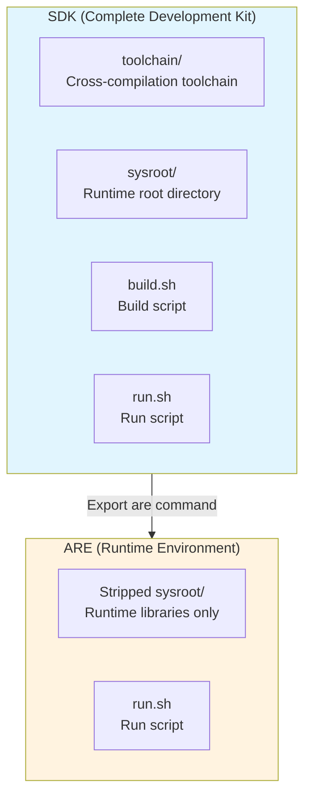
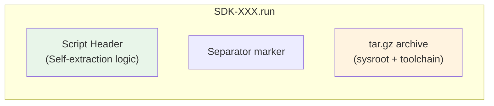
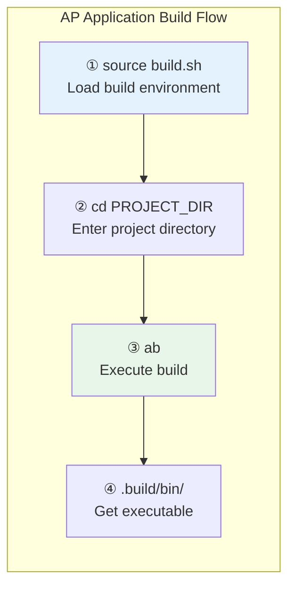
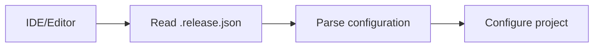
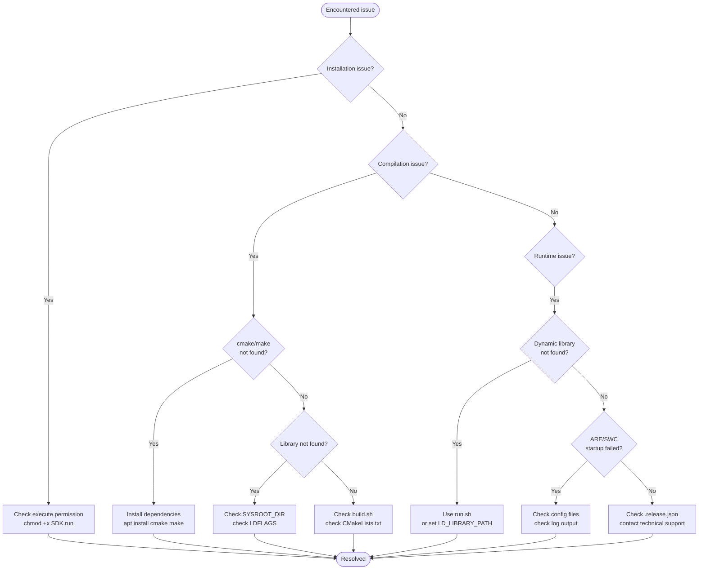

# SDK User Manual

> **Document Version**: v2.0 | **Applicable Version**: AP SDK 2.0+ | **Last Updated**: 2026-04-16

---

## Table of Contents

1. [Overview](#1-overview)
2. [System Requirements and Constraints](#2-system-requirements-and-constraints)
3. [Obtaining the SDK](#3-obtaining-the-sdk)
4. [Installation and Deployment](#4-installation-and-deployment)
5. [SDK Directory Structure](#5-sdk-directory-structure)
6. [Compiling AP Applications with the SDK](#6-compiling-ap-applications-with-the-sdk)
7. [ARE Runtime Environment](#7-are-runtime-environment)
8. [Running AP Applications](#8-running-ap-applications)
9. [Configuration Files](#9-configuration-files)
10. [IDE Integration Guide](#10-ide-integration-guide)
11. [FAQ and Troubleshooting](#11-faq-and-troubleshooting)
12. [Appendix](#12-appendix)

---

## 1. Overview

### 1.1 What is the SDK?

**SDK (Software Development Kit)** is the development toolkit for ISOFT's **Adaptive Platform (AP)**. It provides developers with a complete environment for compiling, debugging, and deploying AP applications.

The core design philosophy of the SDK is: **install once, compile anywhere, move freely, no reconfiguration needed**.

### 1.2 Core Capabilities of the SDK

| Capability                       | Description                                                               |
| -------------------------------- | ------------------------------------------------------------------------- |
| **Self-extracting installation** | `.run` self-extracting package; no additional dependencies required       |
| **Cross-compilation support**    | Supports native compilation and cross-compilation (s32g/wrlinux/x3, etc.) |
| **One-click build**              | Built-in `build.sh` script supporting two execution modes                 |
| **Free relocation**              | Can be moved to any location after installation without reconfiguration   |
| **ARE export**                   | Can export a lightweight ARE runtime environment from the SDK             |
| **IDE integration**              | JSON-format release information for easy IDE configuration                |
| **Debug info separation**        | Supports standalone debug info packages to reduce deployment size         |

### 1.3 Relationship Between SDK and ARE



| Aspect               | SDK                         | ARE                                   |
| -------------------- | --------------------------- | ------------------------------------- |
| **Purpose**          | Development & compilation   | Target machine deployment & execution |
| **Toolchain**        | ✅ Full cross-compiler       | ❌ Not included                        |
| **Headers**          | ✅ Full headers              | ❌ Runtime headers only                |
| **Static libraries** | ✅ Included                  | ❌ Not included                        |
| **Size**             | Hundreds of MB ~ several GB | Tens of MB ~ hundreds of MB           |
| **Typical scenario** | Development workstation     | Embedded target machine               |

### 1.4 SDK File Naming Convention

SDK package filenames follow this format:

```
SDK-{apall_version}.{build_version}-{target_arch}-{host_osv}-{toolchain}-{build_type}.run
```

**Examples:**

```bash
# Native compilation SDK (x86_64 Ubuntu 20.04)
SDK-1.0.0.2608-x86_64-ubuntu20.04-native-Release.run

# Cross-compilation SDK (aarch64 target)
SDK-1.0.0.2608-aarch64-ubuntu20.04-wrlinux-Debug.run
```

**Naming segments:**

| Segment         | Example              | Description                           |
| --------------- | -------------------- | ------------------------------------- |
| `apall_version` | `1.0.0`              | APALL source version number           |
| `build_version` | `2608`               | Build version number (date or custom) |
| `target_arch`   | `x86_64` / `aarch64` | Target program architecture           |
| `host_osv`      | `ubuntu20.04`        | Host operating system version         |
| `toolchain`     | `native` / `wrlinux` | Toolchain name                        |
| `build_type`    | `Release` / `Debug`  | Build type                            |

---

## 2. System Requirements and Constraints

### 2.1 Hardware Requirements

| Resource             | Minimum        | Recommended | Notes                                                                     |
| -------------------- | -------------- | ----------- | ------------------------------------------------------------------------- |
| **CPU architecture** | x86_64 (amd64) | x86_64      | Currently only supports amd64 architecture                                |
| **CPU cores**        | 2 cores        | 4+ cores    | Compilation is highly parallel; multi-core significantly speeds up builds |
| **Memory**           | 4 GB           | 8 GB+       | Large project compilation may require more memory                         |
| **Disk space**       | 5 GB           | 20 GB+      | Cross-compilation SDK is large                                            |
| **Network**          | Optional       | Optional    | SDK does not require network after installation                           |

### 2.2 Operating System Requirements

| Operating System | Version     | Status                         |
| ---------------- | ----------- | ------------------------------ |
| **Ubuntu**       | 20.04 LTS   | ✅ Fully supported              |
| **Ubuntu**       | 22.04 LTS   | ✅ Supported                    |
| **CentOS**       | 7/8         | ⚠️ Not verified                 |
| **Debian**       | 10+         | ⚠️ Not verified                 |
| **macOS**        | Any version | ❌ Not supported                |
| **Windows**      | Any version | ❌ Not supported (requires WSL) |

### 2.3 Software Dependencies

The SDK requires the following software packages:

| Package      | Minimum Version | Description                  | Install Command               |
| ------------ | --------------- | ---------------------------- | ----------------------------- |
| **bash**     | 4.0+            | Script execution environment | Pre-installed                 |
| **cmake**    | 3.16.3          | Build system                 | `apt install cmake`           |
| **make**     | 4.2.1           | Build tool                   | `apt install make`            |
| **gcc/g++**  | 9.3.0           | Host compiler                | `apt install build-essential` |
| **tar**      | Any             | Archive tool                 | Pre-installed                 |
| **gzip**     | Any             | Compression tool             | Pre-installed                 |
| **realpath** | Any             | Path resolution              | `apt install coreutils`       |

**One-click dependency install:**

```bash
sudo apt-get update
sudo apt-get install -y cmake make build-essential coreutils
```

---

## 3. Obtaining the SDK

### 3.1 Acquisition Methods

| Method               | Description                                              | Use Case               |
| -------------------- | -------------------------------------------------------- | ---------------------- |
| **Official release** | Download pre-compiled SDK from ISOFT's official channels | Production environment |
| **Self-build**       | Build from source using the `sdk-utils` tool             | Custom requirements    |
| **CI/CD output**     | Obtain from continuous integration system                | Development & testing  |

### 3.2 Building the SDK with sdk-utils

If you need to build the SDK from source, use the `sdk-utils` tool:

```bash
# One-click publish (compile + package)
python3 sdk-utils pub apall:main --toolchain native -o ./output

# Or step-by-step
python3 sdk-utils build apall:main --toolchain native
python3 sdk-utils pack ./var/native -o ./output
```

For detailed build procedures, refer to the *sdk-utils User Manual*.

---

## 4. Installation and Deployment

### 4.1 SDK Package Structure

The SDK package is a **self-extracting Bash script** with the following structure:



**How it works:**

1. The script header contains self-extraction logic (Bash code)
2. The script tail embeds a tar.gz archive (binary data)
3. When executed, the script uses the `tail` command to extract and decompress the archive

### 4.2 Installing the SDK

#### 4.2.1 Basic Installation

```bash
# Install to the current directory
./SDK-1.0.0.2608-x86_64-ubuntu20.04-native-Release.run ./

# Install to a specified directory
./SDK-1.0.0.2608-x86_64-ubuntu20.04-native-Release.run /opt/ap-sdk

# Install to the user's home directory
./SDK-1.0.0.2608-x86_64-ubuntu20.04-native-Release.run ~/ap-sdk
```

**Installation output example:**

```
Unpacking SDK ...
two compilation modes are provided:

Subshell Execution Mode: Runs the script in a new subshell process.
    Command: /opt/ap-sdk/ara-sysroot/build.sh PROJECT_DIR

Sourcing Execution Mode: Load all the environment variables required for 
compilation into the current shell, and provide a function command for compilation.
    Command: source /opt/ap-sdk/ara-sysroot/build.sh; cd PROJECT_DIR; ab
```

#### 4.2.2 View Version Information (Without Installing)

```bash
./SDK-1.0.0.2608-x86_64-ubuntu20.04-native-Release.run -v
```

Outputs JSON-format release information (see Chapter 9).

### 4.3 Post-Installation Verification

After installation, verify SDK integrity:

```bash
cd /opt/ap-sdk  # Your installation directory

# Check directory structure
ls -la
# Should contain: ara-sysroot/ and toolchain/

# Check build scripts
ls -la ara-sysroot/build.sh
ls -la ara-sysroot/run.sh

# Check toolchain configuration
ls -la toolchain/toolchain.cmake

# Check release information
cat ara-sysroot/.release.json | jq .
```

### 4.4 Uninstalling the SDK

The SDK is a **portable application**; uninstallation simply requires deleting the installation directory:

```bash
# Remove the entire SDK directory
rm -rf /opt/ap-sdk

# Clean up environment variables (if build.sh was sourced)
unset SYSROOT_DIR TOOLCHAIN_DIR CMAKE_ARGS
```

---

## 5. SDK Directory Structure

### 5.1 Top-Level Directory Structure

The SDK directory structure after installation:

```
/opt/ap-sdk/                          # SDK installation root directory
├── ara-sysroot/                      # AP system runtime/compilation root directory
│   ├── .release.json                 # SDK release information (JSON format)
│   ├── build.sh                      # Build environment script ⭐
│   ├── run.sh                        # AP run script ⭐
│   ├── date.txt                      # Build date marker
│   ├── ara/                          # AP runtime framework
│   │   ├── ara_ver1.json             # Version information
│   │   ├── ara_ver1.md5              # Checksum file
│   │   ├── core/                     # Core components
│   │   ├── framework/                # Framework components
│   │   │   └── ${VERSION}/
│   │   │       ├── bin/              # Executables
│   │   │       ├── lib/              # Dynamic libraries
│   │   │       └── etc/              # Configuration files
│   │   └── swcls/                    # Software component library
│   ├── ara-builder/                  # SDK build tools
│   │   ├── bin/
│   │   └── etc/
│   ├── ara-tools/                    # AP companion tools
│   │   ├── machineCommand            # Machine management command
│   │   ├── configMachine             # Machine configuration tool
│   │   ├── projectGenerate           # Project generator
│   │   ├── pkgGen                    # Package generator
│   │   ├── vpkgGen                   # Virtual package generator
│   │   ├── sdkUtils                  # SDK utilities
│   │   └── ...
│   └── usr/                          # User libraries and headers
│       ├── include/                  # Header file directory
│       ├── lib/                      # Library file directory
│       ├── doc/                      # Documentation
│       └── tools/                    # Tools
└── toolchain/                        # Cross-compilation toolchain
    ├── toolchain.cmake               # CMake toolchain configuration ⭐
    ├── init.sh                       # Toolchain environment initialization
    └── bin/                          # Compiler executables
        ├── gcc
        ├── g++
        ├── ld
        └── ...
```

### 5.2 Key Files

| File/Directory              | Description              | Purpose                                                          |
| --------------------------- | ------------------------ | ---------------------------------------------------------------- |
| `ara-sysroot/build.sh`      | Build environment script | Sets compile environment variables, provides `ab` build function |
| `ara-sysroot/run.sh`        | AP run script            | Start/stop AP applications, manage runtime environment           |
| `ara-sysroot/.release.json` | Release information      | Records SDK version, toolchain, build parameters, etc.           |
| `toolchain/toolchain.cmake` | CMake configuration      | Cross-compilation configuration for CMake                        |
| `ara/framework/`            | Framework directory      | AP core framework libraries and configuration                    |
| `ara/swcls/`                | Software components      | Software component library (SWCL)                                |
| `usr/include/`              | Headers                  | Third-party library headers (boost, openssl, etc.)               |
| `usr/lib/`                  | Libraries                | Third-party library files                                        |

### 5.3 Environment Variables

The SDK sets the following environment variables through `build.sh`:

| Environment Variable     | Value                              | Description            |
| ------------------------ | ---------------------------------- | ---------------------- |
| `SYSROOT_DIR`            | `/opt/ap-sdk/ara-sysroot`          | sysroot root directory |
| `TOOLCHAIN_DIR`          | `/opt/ap-sdk/toolchain`            | Toolchain directory    |
| `CMAKE_ARGS`             | `-DCMAKE_TOOLCHAIN_FILE=...`       | CMake arguments        |
| `CC`                     | `gcc` / `aarch64-linux-gnu-gcc`    | C compiler             |
| `CXX`                    | `g++` / `aarch64-linux-gnu-g++`    | C++ compiler           |
| `CFLAGS`                 | `-I${SYSROOT_DIR}/usr/include`     | C compiler options     |
| `CXXFLAGS`               | `-I${SYSROOT_DIR}/usr/include`     | C++ compiler options   |
| `LDFLAGS`                | `-L${SYSROOT_DIR}/usr/lib`         | Linker options         |
| `PKG_CONFIG_PATH`        | `${SYSROOT_DIR}/usr/lib/pkgconfig` | pkg-config path        |
| `PKG_CONFIG_SYSROOT_DIR` | `${SYSROOT_DIR}`                   | pkg-config sysroot     |

---

## 6. Compiling AP Applications with the SDK

### 6.1 Build Flow Overview



### 6.2 Two Execution Modes of build.sh

`build.sh` supports **two execution modes** for different use cases:

#### Mode 1: Source Mode (Recommended)

Loads the build environment into the current shell and provides the `ab` function for compilation.

```bash
# 1. Load the build environment (note the source command)
source /opt/ap-sdk/ara-sysroot/build.sh

# 2. Enter your AP project directory
cd /path/to/your-ap-project

# 3. Build (using the ab function)
ab

# 4. Build and install
ab -i

# 5. Build and install to a custom directory
ab -i /custom/install/path
```

**Characteristics:**

- Environment variables persist in the current shell session
- Can use the `ab` function for quick compilation
- Suitable for interactive development

#### Mode 2: Script Mode (Subprocess)

Called directly as a script; executes compilation in a new subprocess.

```bash
# Directly call build.sh to compile a specified project
/opt/ap-sdk/ara-sysroot/build.sh /path/to/your-ap-project
```

**Characteristics:**

- Does not affect the current shell environment
- Suitable for automated scripts and CI/CD
- Reloads the environment on each call

### 6.3 The ab Function

The `ab` (Adaptive Build) function is a convenient build command provided by `build.sh`.

#### Usage

```bash
ab [OPTIONS]
```

#### Options

| Option       | Description                                  |
| ------------ | -------------------------------------------- |
| `-i`         | Execute install after build (`make install`) |
| `-i <PATH>`  | Install to a specified path after build      |
| `-h, --help` | Show help information                        |

#### How It Works

```bash
function ab() {
    # 1. Create build directory
    mkdir -p .build
    
    # 2. Enter build directory
    pushd .build
    
    # 3. Run CMake (using SDK-provided toolchain configuration)
    cmake ${CMAKE_ARGS} -DCMAKE_INSTALL_PREFIX=${INSTALL_DIR} ..
    
    # 4. Parallel build
    make -j$(nproc)
    
    # 5. Optional: install
    if [ need install ]; then
        make install
    fi
    
    popd
}
```

### 6.4 Build Examples

#### Example 1: Building HelloWorld

```bash
# 1. Load the SDK environment
source /opt/ap-sdk/ara-sysroot/build.sh

# 2. Enter the project directory
cd ~/my-ap-projects/HelloWorld

# 3. Build
ab

# 4. View output
ls -la .build/bin/HelloWorld
```

#### Example 2: Build and Install

```bash
source /opt/ap-sdk/ara-sysroot/build.sh
cd ~/my-ap-projects/MyService

# Build and install to default location (.build/install)
ab -i

# Or install to a specified location
ab -i /opt/my-ap-apps
```

#### Example 3: Script Mode Build (CI/CD)

```bash
#!/bin/bash
# ci-build.sh

SDK_PATH="/opt/ap-sdk"
PROJECT_PATH="$1"

# Build using script mode
${SDK_PATH}/ara-sysroot/build.sh ${PROJECT_PATH}

# Check build result
if [ -f "${PROJECT_PATH}/.build/bin/my-app" ]; then
    echo "Build successful!"
    exit 0
else
    echo "Build failed!"
    exit 1
fi
```

### 6.5 Custom CMake Parameters

If you need to add custom CMake parameters on top of `ab`, you can call `cmake` directly:

```bash
source /opt/ap-sdk/ara-sysroot/build.sh
cd ~/my-ap-projects/MyApp

mkdir -p .build
cd .build

# Use SDK-provided CMAKE_ARGS and add custom parameters
cmake ${CMAKE_ARGS} \
    -DCMAKE_INSTALL_PREFIX=/custom/path \
    -DENABLE_FEATURE_X=ON \
    -DDEBUG_MODE=OFF \
    ..

make -j$(nproc)
```

---

## 7. ARE Runtime Environment

### 7.1 What is ARE?

**ARE (Adaptive platform Runtime Environment)** is the lightweight runtime environment for AP, used to deploy and run AP applications on target machines.

**ARE vs SDK:**

| Feature                   | SDK                         | ARE                         |
| ------------------------- | --------------------------- | --------------------------- |
| **Size**                  | Hundreds of MB ~ several GB | Tens of MB ~ hundreds of MB |
| **Toolchain**             | ✅ Full compiler             | ❌ Not included              |
| **Headers**               | ✅ Full                      | ❌ Runtime-only              |
| **Purpose**               | Development & compilation   | Target machine execution    |
| **Installation location** | Development workstation     | Embedded target machine     |

### 7.2 Exporting ARE from SDK

Use the SDK's built-in `sdkUtils` tool to export ARE:

```bash
# Enter the SDK directory
cd /opt/ap-sdk/ara-sysroot

# Export ARE to a specified directory
./ara-tools/sdkUtils are -o ./output ./

# Or use the full path
/opt/ap-sdk/ara-sysroot/ara-tools/sdkUtils are \
    -o ~/are-output \
    /opt/ap-sdk/ara-sysroot
```

#### Export Options

| Option        | Description                                                       | Default           |
| ------------- | ----------------------------------------------------------------- | ----------------- |
| `-o <DIR>`    | Output directory                                                  | Current directory |
| `-t <TYPE>`   | Export type: `are` (self-extracting) or `tar` (tar.gz)            | `are`             |
| `-s <LEVEL>`  | Strip level: `0` (none) / `1` (files) / `2` (binary) / `3` (full) | `0`               |
| `-f <CONFIG>` | Export configuration file                                         | None              |

#### Strip Levels

| Level | Description                                             | Size Impact |
| ----- | ------------------------------------------------------- | ----------- |
| `0`   | No stripping; retain all files                          | Largest     |
| `1`   | File stripping: remove unnecessary dependency libraries | Medium      |
| `2`   | Binary stripping: strip all ELF files                   | Smaller     |
| `3`   | Full stripping: file stripping + binary stripping       | Smallest    |

### 7.3 ARE Installation

The exported ARE file is similar to the SDK — also in self-extracting format:

```bash
# Install ARE on the target machine
./SDK-1.0.0.2608-x86_64-ubuntu20.04-native-Release.run /opt/ap-are
```

### 7.4 ARE Directory Structure

The ARE directory structure is similar to the SDK's `ara-sysroot`, but with the toolchain and development files removed:

```
/opt/ap-are/                          # ARE installation root directory
├── .release.json                     # Release information
├── run.sh                            # Run script ⭐
├── ara/                              # AP runtime framework
│   ├── framework/                    # Framework libraries
│   └── swcls/                        # Software components
└── usr/                              # Runtime libraries
    └── lib/                          # Dynamic libraries
```

---

## 8. Running AP Applications

### 8.1 Runtime Environment Preparation

Before running AP applications, ensure:

1. **SDK or ARE is properly installed**
2. **AP application has been compiled**
3. **Configuration files are ready**

### 8.2 Running with run.sh

The `run.sh` script provided by SDK/ARE is the primary tool for running AP applications.

#### Basic Usage

```bash
# Enter the SDK/ARE directory
cd /opt/ap-sdk/ara-sysroot  # or /opt/ap-are

# Run an AP application
./run.sh -a /path/to/your-app
```

#### run.sh Options

| Option       | Description                                       |
| ------------ | ------------------------------------------------- |
| `-a <APP>`   | Run a specified application                       |
| `-r`         | Run ARE (start framework)                         |
| `-R`         | Run ARE (without cgroup, suitable for containers) |
| `-s`         | Stop ARE                                          |
| `-u`         | Uninstall ARE                                     |
| `-d <PORT>`  | DEBUG mode, listen on specified port              |
| `-c <STATE>` | Switch function group state                       |
| `-C <FG>`    | Get function group state                          |
| `-m <STATE>` | Switch state machine state                        |
| `-M <SM>`    | Get state machine state                           |

#### Run Examples

```bash
cd /opt/ap-sdk/ara-sysroot

# Run a single application
./run.sh -a /home/user/my-app/bin/my-service

# Start the ARE framework
./run.sh -r

# Stop ARE
./run.sh -s

# Run in DEBUG mode
./run.sh -r -d 1234
```

### 8.3 Runtime Environment Variables

`run.sh` automatically sets the following environment variables:

| Environment Variable            | Description                     | Default Value                     |
| ------------------------------- | ------------------------------- | --------------------------------- |
| `LD_LIBRARY_PATH`               | Dynamic library search path     | `${ARA_SYSROOT}/usr/lib`          |
| `ISOFT_ARA_FSH_SYSROOT`         | Communication identifier        | SDK installation path             |
| `ISOFT_ARA_FSH_PROC_CONFIG_DIR` | Process configuration directory | `etc/process` under app directory |
| `ISOFT_ARA_RUNTIME_DIR`         | Runtime temporary directory     | `/run`                            |

### 8.4 Manual Execution (Advanced)

If you prefer not to use `run.sh`, you can manually set environment variables:

```bash
# 1. Set environment variables
export LD_LIBRARY_PATH="/opt/ap-sdk/ara-sysroot/ara/framework/1.0.0/lib:\
/opt/ap-sdk/ara-sysroot/usr/lib"

# 2. Set the communication identifier
export ISOFT_ARA_FSH_SYSROOT="/opt/ap-sdk/ara-sysroot"

# 3. Set the configuration directory
export ISOFT_ARA_FSH_PROC_CONFIG_DIR="/path/to/your-app/etc/process"

# 4. Set the runtime directory (optional, if /run is read-only)
export ISOFT_ARA_RUNTIME_DIR="/tmp"

# 5. Run the application
/path/to/your-app/bin/my-service
```

---

## 9. Configuration Files

### 9.1 .release.json

`.release.json` is the SDK's core configuration file, recording the complete release information.

#### File Location

```
ara-sysroot/.release.json
```

#### Complete Example

```json
{
    "SDK_IDE_API_VERSION": "4.0",
    "build_args": {
        "toolchain": "native",
        "build_type": "Release",
        "build_version": "0327",
        "cmake_args": "-DCMAKE_TOOLCHAIN_FILE=${TOOLCHAIN_DIR}/toolchain.cmake ",
        "environ": {
            "PATH": "/opt/ap-sdk/toolchain/bin:/usr/bin",
            "CC": "gcc",
            "CXX": "g++",
            "CFLAGS": "",
            "CXXFLAGS": "-I${SYSROOT_DIR}/usr/include",
            "LDFLAGS": "-L${SYSROOT_DIR}/usr/lib",
            "PKG_CONFIG_PATH": "${SYSROOT_DIR}/usr/lib/pkgconfig",
            "PKG_CONFIG_SYSROOT_DIR": "${SYSROOT_DIR}",
            "PKG_CONFIG_ALLOW_SYSTEM_LIBS": "true"
        }
    },
    "apall_info": {
        "version": "1.0.0",
        "commit_date": "20260326192557",
        "commit_hash": "724ca641c54aac464c97f98de01cea2c60af9d34",
        "commit_log": "fix: change ARA_MAJOR_VERSION to be consistent with the original",
        "submodule_hash": {
            "com": "da5db5bf4d3b99079047d4df34b22725a5743c70",
            "core": "dd3865d1b87b01dbf3845582784eb3a512da71c7",
            "crypto": "1b43b54c74921eee9b13d9102616bac230c34fab",
            "diag": "55d57f1b52347baf9bfbc1194109c514e12dd4ad",
            "exec": "71e4db9344b111bf2e5dd75ed93b672215f927bd",
            "fw": "f127e68173f6816c399122db0e6a5ccc65810946"
        }
    }
}
```

#### Field Descriptions

| Field                       | Type   | Description                        |
| --------------------------- | ------ | ---------------------------------- |
| `SDK_IDE_API_VERSION`       | string | SDK IDE API version                |
| `build_args.toolchain`      | string | Toolchain name                     |
| `build_args.build_type`     | string | Build type (Release/Debug)         |
| `build_args.build_version`  | string | Build version number               |
| `build_args.cmake_args`     | string | CMake arguments                    |
| `build_args.environ`        | object | Environment variable configuration |
| `apall_info.version`        | string | APALL version number               |
| `apall_info.commit_date`    | string | Source commit date                 |
| `apall_info.commit_hash`    | string | Source commit hash                 |
| `apall_info.commit_log`     | string | Commit log message                 |
| `apall_info.submodule_hash` | object | Submodule hashes                   |

### 9.2 toolchain.cmake

`toolchain.cmake` is the CMake cross-compilation configuration file.

#### File Location

```
toolchain/toolchain.cmake
```

#### Key Configuration

```cmake
# Set target system
set(CMAKE_SYSTEM_NAME Linux)
set(CMAKE_SYSTEM_PROCESSOR aarch64)

# Set sysroot
set(CMAKE_SYSROOT "${SYSROOT}")

# Set compilers
set(CMAKE_C_COMPILER "aarch64-linux-gnu-gcc")
set(CMAKE_CXX_COMPILER "aarch64-linux-gnu-g++")

# Set find path modes (only search in sysroot)
set(CMAKE_FIND_ROOT_PATH_MODE_PROGRAM NEVER)
set(CMAKE_FIND_ROOT_PATH_MODE_LIBRARY ONLY)
set(CMAKE_FIND_ROOT_PATH_MODE_INCLUDE ONLY)
set(CMAKE_FIND_ROOT_PATH_MODE_PACKAGE ONLY)

# Set installation paths
set(CMAKE_INSTALL_PREFIX "/usr")
set(CMAKE_INSTALL_LIBDIR "lib")
```

### 9.3 ara_ver1.json

`ara_ver1.json` is the AP framework version information file.

#### File Location

```
ara-sysroot/ara/ara_ver1.json
```

#### Content Example

```json
{
    "version": "1.0.0",
    "build_date": "2026-03-26",
    "components": {
        "core": "1.0.0",
        "framework": "1.0.0",
        "com": "1.0.0"
    }
}
```

---

## 10. IDE Integration Guide

### 10.1 General Integration Approach

The SDK's JSON-format release information (`.release.json`) makes it easy for IDEs to read configuration:



### 10.2 VS Code Integration Example

#### Configure CMake Toolchain

In `.vscode/settings.json`:

```json
{
    "cmake.configureSettings": {
        "CMAKE_TOOLCHAIN_FILE": "/opt/ap-sdk/toolchain/toolchain.cmake"
    },
    "cmake.environment": {
        "SYSROOT_DIR": "/opt/ap-sdk/ara-sysroot",
        "TOOLCHAIN_DIR": "/opt/ap-sdk/toolchain"
    }
}
```

#### Configure C/C++ IntelliSense

In `.vscode/c_cpp_properties.json`:

```json
{
    "configurations": [
        {
            "name": "AP-SDK",
            "includePath": [
                "${workspaceFolder}/**",
                "/opt/ap-sdk/ara-sysroot/usr/include/**",
                "/opt/ap-sdk/ara-sysroot/ara/framework/**"
            ],
            "defines": [],
            "compilerPath": "/opt/ap-sdk/toolchain/bin/aarch64-linux-gnu-gcc",
            "cStandard": "c11",
            "cppStandard": "c++14",
            "intelliSenseMode": "linux-gcc-arm64"
        }
    ]
}
```

### 10.3 CLion Integration

Specify the toolchain in `CMakeLists.txt` or `CMake Presets`:

```cmake
# CMakeLists.txt
set(CMAKE_TOOLCHAIN_FILE "/opt/ap-sdk/toolchain/toolchain.cmake" CACHE STRING "")
```

Or in CLion's CMake options:

```
-DCMAKE_TOOLCHAIN_FILE=/opt/ap-sdk/toolchain/toolchain.cmake
```

### 10.4 Command-Line Tool Integration

```bash
# Read SDK version
SDK_VERSION=$(cat /opt/ap-sdk/ara-sysroot/.release.json | jq -r '.apall_info.version')

# Read toolchain name
TOOLCHAIN=$(cat /opt/ap-sdk/ara-sysroot/.release.json | jq -r '.build_args.toolchain')

# Read build type
BUILD_TYPE=$(cat /opt/ap-sdk/ara-sysroot/.release.json | jq -r '.build_args.build_type')
```

---

## 11. FAQ and Troubleshooting

### Q1: "Permission denied" when installing the SDK

**Cause**: The SDK file does not have execute permission.

**Solution**:

```bash
chmod +x SDK-XXX.run
./SDK-XXX.run ./
```

### Q2: ab command not found after sourcing build.sh

**Cause**: `build.sh` was not properly sourced; it was executed as a subprocess instead.

**Solution**:

```bash
# Wrong way (subprocess execution)
./ara-sysroot/build.sh

# Correct way (source execution)
source ./ara-sysroot/build.sh
# or
. ./ara-sysroot/build.sh
```

### Q3: "cmake: command not found" during compilation

**Cause**: CMake is not installed on the system.

**Solution**:

```bash
sudo apt-get install cmake
```

### Q4: "cannot find -lxxx" during compilation

**Cause**: The linker cannot find the library file.

**Solution**:

1. Check if the library exists in `ara-sysroot/usr/lib/`
2. Check if `LDFLAGS` is set correctly
3. Confirm the library filename is correct (e.g., `libxxx.so`)

### Q5: "error while loading shared libraries" when running an application

**Cause**: Dynamic library not found at runtime.

**Solution**:

```bash
# Method 1: Use run.sh (automatically sets LD_LIBRARY_PATH)
./run.sh -a /path/to/your-app

# Method 2: Manually set LD_LIBRARY_PATH
export LD_LIBRARY_PATH="/opt/ap-sdk/ara-sysroot/usr/lib:$LD_LIBRARY_PATH"
./your-app

# Method 3: Use ldconfig
sudo echo "/opt/ap-sdk/ara-sysroot/usr/lib" > /etc/ld.so.conf.d/ap-sdk.conf
sudo ldconfig
```

### Q6: Cross-compiled program won't run on the target machine

**Cause**:

1. Target machine is missing runtime libraries
2. Architecture mismatch
3. Incorrect dynamic linker path

**Solution**:

1. Install ARE or complete runtime libraries on the target machine
2. Confirm the SDK's `target_arch` matches the target machine
3. Check the dynamic linker used at link time (`readelf -l your-app | grep interpreter`)

### Q7: How to view SDK detailed information?

**Solution**:

```bash
# View version information
./SDK-XXX.run -v

# View installed SDK information
cat /opt/ap-sdk/ara-sysroot/.release.json | jq .

# View toolchain configuration
cat /opt/ap-sdk/toolchain/toolchain.cmake
```

### Q8: Can the SDK be moved after installation?

**Answer**: Yes! SDK 2.0+ supports free relocation:

```bash
# Install to a temporary location
./SDK-XXX.run /tmp/ap-sdk

# Move to the final location
mv /tmp/ap-sdk /opt/ap-sdk

# Re-source build.sh to use
source /opt/ap-sdk/ara-sysroot/build.sh
```

### Q9: How to install multiple SDK versions simultaneously?

**Solution**: Install to different directories:

```bash
./SDK-1.0.0.2608-native.run /opt/ap-sdk-1.0.0-native
./SDK-1.0.0.2608-wrlinux.run /opt/ap-sdk-1.0.0-wrlinux
./SDK-1.3.0.2608-native.run /opt/ap-sdk-1.3.0-native

# Select the corresponding SDK when using
source /opt/ap-sdk-1.0.0-native/ara-sysroot/build.sh
```

### Q10: How to reduce SDK size for deployment?

**Solution**: Export ARE (lightweight runtime):

```bash
# Export minimal-size ARE from SDK
/opt/ap-sdk/ara-sysroot/ara-tools/sdkUtils are \
    -s 3 \
    -o ./are-output \
    /opt/ap-sdk/ara-sysroot

# Install ARE (significantly smaller)
./ARE-XXX.run /opt/ap-are
```

---

## 12. Appendix

### Appendix A: SDK Installation Directory Structure (Complete)

```
/opt/ap-sdk/
├── ara-sysroot/
│   ├── .release.json
│   ├── build.sh
│   ├── run.sh
│   ├── date.txt
│   ├── ara/
│   │   ├── ara_ver1.json
│   │   ├── ara_ver1.md5
│   │   ├── core/
│   │   │   └── ${VERSION}/
│   │   │       ├── bin/
│   │   │       ├── lib/
│   │   │       └── etc/
│   │   ├── framework/
│   │   │   └── ${VERSION}/
│   │   │       ├── bin/
│   │   │       │   ├── ara_cm
│   │   │       │   ├── ara_com
│   │   │       │   ├── ara_diag
│   │   │       │   ├── ara_exec
│   │   │       │   └── ...
│   │   │       ├── lib/
│   │   │       │   ├── libara_cm.so
│   │   │       │   ├── libara_com.so
│   │   │       │   └── ...
│   │   │       └── etc/
│   │   └── swcls/
│   │       └── ${SWC_NAME}/
│   │           └── ${VERSION}/
│   │               ├── bin/
│   │               └── lib/
│   ├── ara-builder/
│   │   ├── bin/
│   │   └── etc/
│   │       └── package/
│   ├── ara-tools/
│   │   ├── adapter_hub.sh
│   │   ├── configMachine
│   │   ├── machineCommand
│   │   ├── projectGenerate
│   │   ├── pkgGen
│   │   ├── vpkgGen
│   │   ├── sdkUtils
│   │   ├── updateProject
│   │   └── ...
│   └── usr/
│       ├── include/
│       │   ├── ara/
│       │   ├── boost/
│       │   ├── openssl/
│       │   └── ...
│       ├── lib/
│       │   ├── libboost_*.so
│       │   ├── libssl.so
│       │   └── ...
│       ├── doc/
│       └── tools/
└── toolchain/
    ├── toolchain.cmake
    ├── init.sh
    └── bin/
        ├── gcc -> aarch64-linux-gnu-gcc
        ├── g++ -> aarch64-linux-gnu-g++
        ├── aarch64-linux-gnu-gcc
        ├── aarch64-linux-gnu-g++
        ├── aarch64-linux-gnu-ld
        ├── aarch64-linux-gnu-ar
        └── ...
```

### Appendix B: Command Quick Reference

#### SDK Package Commands

| Command                     | Description                      |
| --------------------------- | -------------------------------- |
| `./SDK-XXX.run ./`          | Install to the current directory |
| `./SDK-XXX.run /opt/ap-sdk` | Install to a specified directory |
| `./SDK-XXX.run -v`          | View version information         |

#### build.sh Commands

| Command                                | Description                           |
| -------------------------------------- | ------------------------------------- |
| `source ara-sysroot/build.sh`          | Load build environment                |
| `ab`                                   | Build the current project             |
| `ab -i`                                | Build and install                     |
| `ab -i /custom/path`                   | Build and install to a specified path |
| `./ara-sysroot/build.sh /project/path` | Script mode build                     |

#### run.sh Commands

| Command                    | Description                 |
| -------------------------- | --------------------------- |
| `./run.sh -a /path/to/app` | Run a specified application |
| `./run.sh -r`              | Start ARE                   |
| `./run.sh -s`              | Stop ARE                    |
| `./run.sh -u`              | Uninstall ARE               |
| `./run.sh -d 1234`         | Run in DEBUG mode           |

#### sdkUtils Commands

| Command                                        | Description                |
| ---------------------------------------------- | -------------------------- |
| `./ara-tools/sdkUtils are -o ./output ./`      | Export ARE                 |
| `./ara-tools/sdkUtils are -s 3 -o ./output ./` | Export with full stripping |

### Appendix C: Environment Variables Quick Reference

| Variable                        | Description                     | Example Value                      |
| ------------------------------- | ------------------------------- | ---------------------------------- |
| `SYSROOT_DIR`                   | sysroot root directory          | `/opt/ap-sdk/ara-sysroot`          |
| `TOOLCHAIN_DIR`                 | Toolchain directory             | `/opt/ap-sdk/toolchain`            |
| `CMAKE_ARGS`                    | CMake arguments                 | `-DCMAKE_TOOLCHAIN_FILE=...`       |
| `CC`                            | C compiler                      | `gcc` or `aarch64-linux-gnu-gcc`   |
| `CXX`                           | C++ compiler                    | `g++` or `aarch64-linux-gnu-g++`   |
| `CFLAGS`                        | C compiler options              | `-I${SYSROOT_DIR}/usr/include`     |
| `CXXFLAGS`                      | C++ compiler options            | `-I${SYSROOT_DIR}/usr/include`     |
| `LDFLAGS`                       | Linker options                  | `-L${SYSROOT_DIR}/usr/lib`         |
| `LD_LIBRARY_PATH`               | Dynamic library path            | `${SYSROOT_DIR}/usr/lib`           |
| `PKG_CONFIG_PATH`               | pkg-config path                 | `${SYSROOT_DIR}/usr/lib/pkgconfig` |
| `ISOFT_ARA_FSH_SYSROOT`         | Communication identifier        | `/opt/ap-sdk/ara-sysroot`          |
| `ISOFT_ARA_FSH_PROC_CONFIG_DIR` | Process configuration directory | `/path/to/app/etc/process`         |
| `ISOFT_ARA_RUNTIME_DIR`         | Runtime directory               | `/run` or `/tmp`                   |

### Appendix D: Troubleshooting Flowchart



---

*This document is maintained by the SDK development team. For questions, please contact technical support.*

*Document version: v2.0 | Last updated: 2026-04-16*
